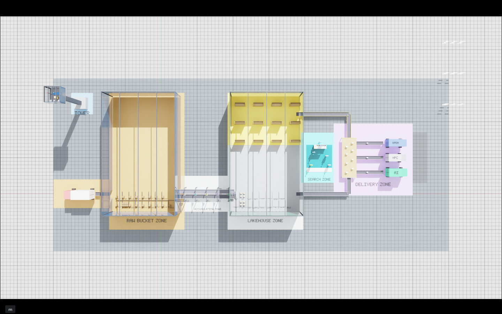
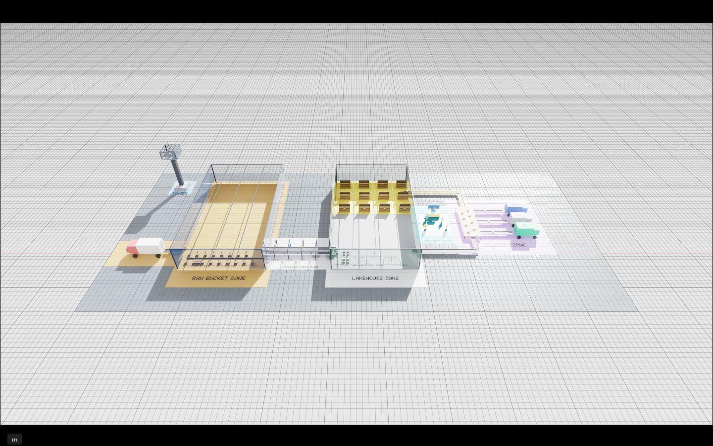
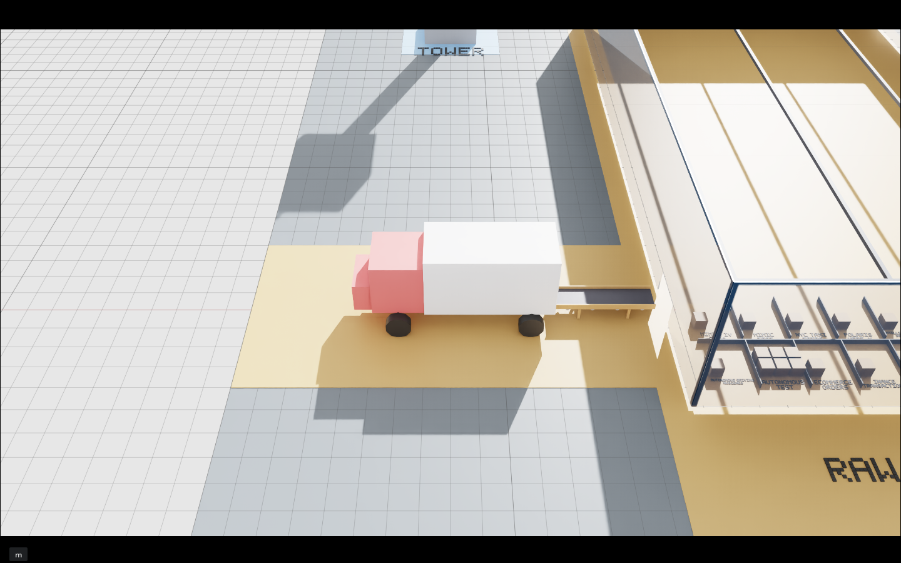
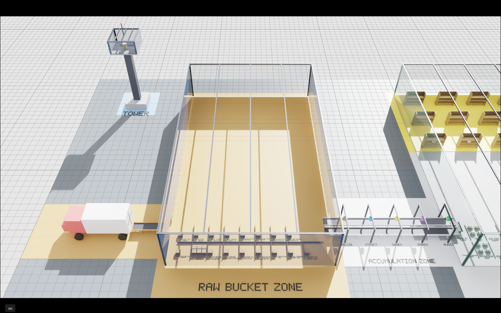
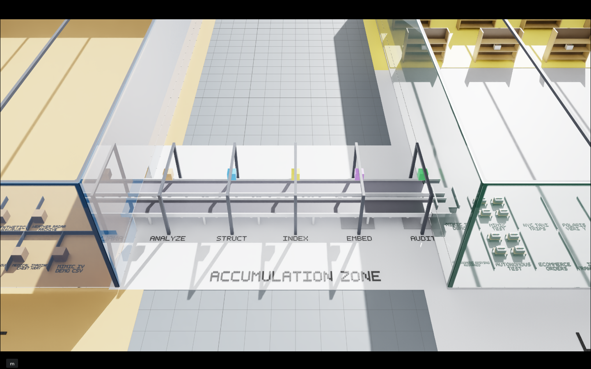
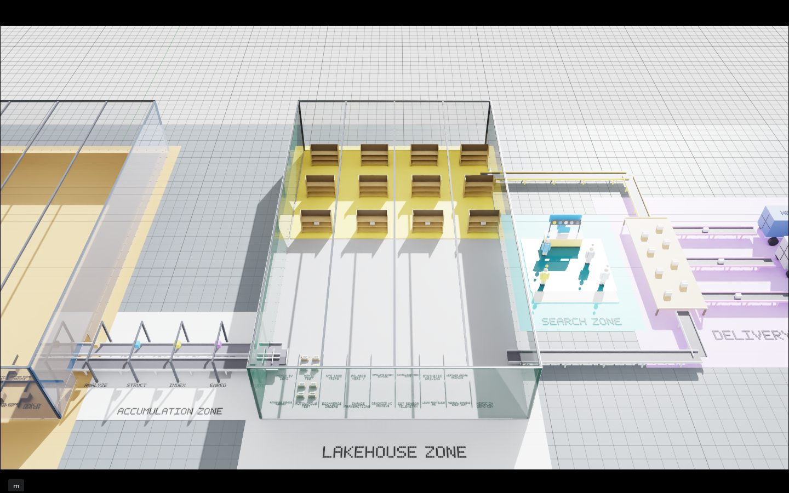
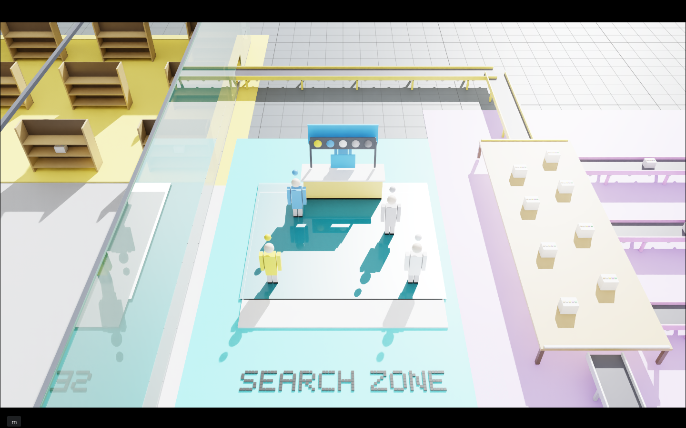
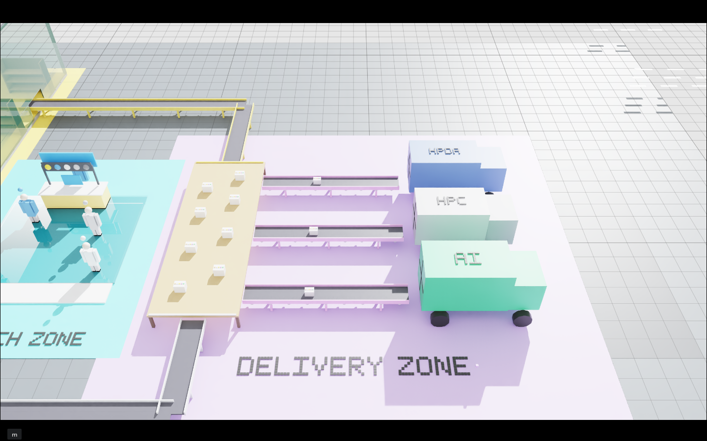
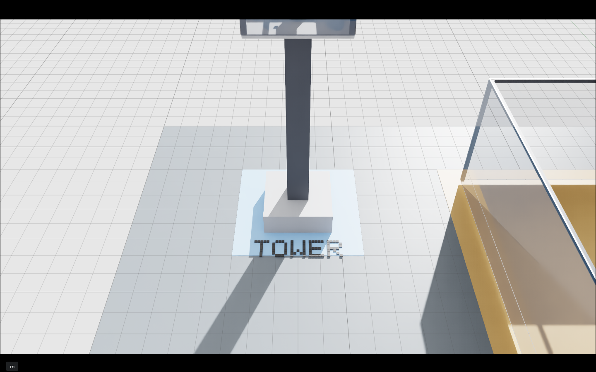

# Trident-Twin

**Data Readiness / Usage Optimization Twin — Trident Lakehouse 공간 의사결정 인터페이스**

Trident-Twin은 Lakehouse를 3D로 꾸미는 뷰어가 아니라, Trident Portal 사용자가
"지금 쓸 수 있는 데이터가 무엇인지"를 한눈에 판단할 수 있는 **공간형 의사결정 지도**다.

---

## 씬 스크린샷

| 정상 90도 | 사선 45도 |
|:---------:|:---------:|
|  |  |

## 존별 스크린샷

| Zone 1 — Truck Yard | Zone 2 — Raw Bucket |
|:-------------------:|:-------------------:|
|  |  |

| Zone 3 — Accumulation | Zone 4 — Lakehouse |
|:---------------------:|:------------------:|
|  |  |

| Zone 5 — Search | Zone 6 — Delivery |
|:---------------:|:-----------------:|
|  |  |

| Zone 7 — Control Tower |
|:----------------------:|
|  |

## 씬 설계도 (Top View)


---

## 씬 레이아웃

| 번호 | 존 | 역할 | 중심 좌표 (x, y) |
|---|---|---|---|
| 1 | **TRUCK YARD** | 트럭 + 인바운드 컨베이어로 원시 데이터 반입 | (-22, 0) |
| 2 | **RAW BUCKET ZONE** | 창고 내부 — 태그 없는 갈색 박스 적재 | (-4, 11) |
| 3 | **ACCUMULATION ZONE** | 2개 컨베이어 벨트를 가로지르는 5개 파이프라인 게이트 | (+13, 0) |
| 4 | **LAKEHOUSE ZONE** | 통합 창고 — 테이블 저장소 + 스테이징 선반 | (+29, 11) |
| 5 | **SEARCH ZONE** | 로비 + 검색 카운터, 사용자 인텐트 → 후보 데이터 | (+44, +10) |
| 6 | **DELIVERY ZONE** | 아웃바운드 벨트 → AI/HPC/HPDA 트럭 | (+59, +10) |
| 7 | **CONTROL TOWER** | 운영자 뷰 — 레디니스, 병목, 라이브 상태 모니터링 | (-22, +25) |

---

## Accumulation Zone — 라이브 컨베이어 애니메이션

Trident Lakehouse ingest 파이프라인의 5단계를 실시간으로 시각화한다.

웹 Portal에서 데이터 ingest가 시작되면:

1. Accumulation Zone 컨베이어 벨트 위에 **상자(Box)** 가 namespace별로 생성된다
2. 파이프라인 단계가 완료될수록 상자가 해당 게이트 위치로 이동한다
3. 각 단계 완료 시 상자 위에 **색깔 배지** 가 누적된다
4. AUDIT 완료 시 상자가 Lakehouse 방향으로 이동 후 제거된다

### 파이프라인 5단계 → 게이트 매핑

| 스텝 | 게이트 | 실제 작업 | 배지 색 | 아티팩트 |
|---|---|---|---|---|
| 1 | **INGEST** | `s3_raw_ingestion` | 브론즈 | S3 raw object |
| 2 | **STRUCT** | `iceberg_structurize` | 스키마 블루 | Iceberg 테이블 |
| 3 | **INDEX** | `search_index_build` | 품질 그린 | trident_search_index |
| 4 | **EMBED** | `milvus_redis_indexing` | 시맨틱 퍼플 | Milvus + Redis 인덱스 |
| 5 | **AUDIT** | `integrity_audit` | 감사 골드 | audit report |

### 상자 생성 조건

twin-hub가 반환하는 `raw_bucket` entity 중 **`s3_file_count > 0`** 이거나
**`index_row_count > 0`** 인 namespace만 상자가 생성된다.
`status == "ok"` / `"PASS"` 인 namespace는 파이프라인 완료로 간주해 상자를 제거한다.

---

## 저장소 구조

```
Trident-Twin/
├── README.md
├── scripts/
│   ├── create_scene.py          # Isaac Sim Python USD 씬 생성기
│   ├── live_sync.py             # 독립 실행형 폴링 스크립트 (참조용)
│   └── render_topdown_diagrams.py
├── twin-hub/
│   ├── app.py                   # FastAPI 상태 어댑터 (fixture + live 모드)
│   ├── run_live.sh              # stats-service 연결 live 실행 스크립트
│   └── test_stub.py
├── exts/
│   └── trident.twin/
│       └── trident/twin/
│           ├── extension.py     # Omniverse Kit extension — 라이브 폴링 + 상자 애니메이션
│           └── extension.toml
├── data/
│   ├── twin_entities.json       # fixture entity 정의 (오프라인 테스트용)
│   └── mock_twin_events.json
├── stages/                      # 생성된 USD 씬 파일들 (.usda)
├── archive/
└── docs/
    └── screenshots/
```

---

## 라이브 연동 아키텍처

```
Trident Lakehouse (K8s)
  stats-service (10.234.33.83)
    GET /api/twin/entities  →  raw_bucket / pipeline_operation / iceberg_table / ...
          |
          | HTTP + Bearer token (Keycloak client_credentials)
          |
  twin-hub  (컨테이너 내부, port 8765)
    app.py — FastAPI
      /api/twin/entities  →  live 모드: stats-service 집계
                          →  fixture 모드: data/twin_entities.json
          |
          | HTTP polling (Kit update loop, 스레딩 없음)
          |
  Isaac Sim extension  (exts/trident.twin)
    extension.py — TridentTwinExtension
      _on_update()  →  _fetch_entities()  →  _sync_boxes()
      → namespace별 Box prim 생성/이동/배지 추가/제거
          |
          | WebRTC (10.38.38.197:49100)
          |
  Portal Digital Twin 탭
    Isaac Sim 스트림을 실시간 표시
```

---

## Isaac Sim Extension — `trident.twin`

### 경로

```
exts/trident.twin/trident/twin/extension.py
```

### 설치 방법

Isaac Sim Extension Manager에서 경로를 추가한다:

```
Extensions > Settings > Extension Search Paths
  + /mnt/Trident-Twin-520d314/exts
```

그 후 `trident.twin` extension을 검색해서 활성화한다.

### UI

- **twin-hub URL**: 폴링 대상 (기본값 `http://localhost:8765`)
- **Interval (s)**: 폴링 간격 초 (최소 2초)
- **Start Live**: 폴링 시작 → 상자 생성/이동 시작
- **Stop**: 폴링 중단

### 환경변수

| 변수 | 기본값 | 설명 |
|---|---|---|
| `TWIN_HUB_URL` | `http://localhost:8765` | twin-hub base URL |
| `TWIN_POLL_INTERVAL` | `5` | 폴링 간격 (초) |

### 동작 상세

```python
GATES = [
    (1, "s3_raw_ingestion",     bronze,  x=7.0),
    (2, "iceberg_structurize",  blue,    x=10.0),
    (3, "search_index_build",   green,   x=13.0),
    (4, "milvus_redis_indexing",purple,  x=16.0),
    (5, "integrity_audit",      gold,    x=19.0),
]
```

- 폴링마다 `/api/twin/entities` 호출
- `pipeline_operation` entity에서 각 게이트 status 추출
- `raw_bucket` entity에서 s3_file_count > 0 인 namespace 목록 추출
- namespace별 Box prim을 `/World/LiveSync/Box_{safe_ns}` 경로에 생성
- 완료 게이트 수에 따라 Box 위치 이동 + 배지 부착
- AUDIT 완료 시 Box → Lakehouse 방향 이동 후 제거

---

## twin-hub

### 경로

```
twin-hub/app.py
```

### 실행 (l40s Isaac Sim 컨테이너 내부)

```bash
docker exec -d isaac-sim-ICH-strongest bash -c '
cd /mnt/Trident-Twin-520d314/twin-hub
TRIDENT_STATS_BASE_URL=http://10.234.33.83 \
TRIDENT_KC_URL=http://10.38.38.220:8080/realms/trident/protocol/openid-connect/token \
TRIDENT_KC_CLIENT_ID=trident-baseline-runner \
TRIDENT_KC_CLIENT_SECRET=<secret> \
/isaac-sim/kit/python/bin/uvicorn app:app \
  --host 0.0.0.0 --port 8765 --log-level info > /tmp/twin-hub.log 2>&1
'
```

> **주의**: 컨테이너 PATH에 uvicorn이 없으므로 반드시 절대경로
> `/isaac-sim/kit/python/bin/uvicorn` 을 사용한다.

### 환경변수

| 변수 | 설명 |
|---|---|
| `TRIDENT_STATS_BASE_URL` | stats-service ClusterIP URL |
| `TRIDENT_KC_URL` | Keycloak token endpoint |
| `TRIDENT_KC_CLIENT_ID` | `trident-baseline-runner` |
| `TRIDENT_KC_CLIENT_SECRET` | OpenBao `secret/trident/baseline_runner` 에서 확인 |

### 엔드포인트

| 메서드 | 경로 | 설명 |
|---|---|---|
| GET | `/api/twin/entities` | 전체 entity 목록 (live 또는 fixture) |
| GET | `/api/twin/live/status` | live 모드 상태 확인 |
| POST | `/api/twin/live/start` | live 모드 시작 |
| POST | `/api/twin/live/stop` | live 모드 중단 |

### Entity 타입

| type | 설명 |
|---|---|
| `pipeline_operation` | 파이프라인 5단계 (step_no 1~5, status: pending/running/done) |
| `raw_bucket` | S3 원본 namespace (s3_file_count, index_row_count, integrity_pct) |
| `iceberg_table` | Lakehouse 등록 테이블 |
| `ready_bundle` | 스테이징 완료 번들 |

---

## USD 씬 생성

```bash
# 로컬에서 l40s로 스크립트 동기화 후 실행
ssh netai@l40s "docker exec isaac-sim-ICH-strongest bash -c \
  'cd /mnt/Trident-Twin-520d314 && /isaac-sim/python.sh scripts/create_scene.py'"
```

생성된 파일: `stages/trident_lakehouse_twin_<YYYYMMDD_HHMM>.usda`

Isaac Sim에서 열기:
```
File > Open > /mnt/Trident-Twin-520d314/stages/trident_lakehouse_twin_<timestamp>.usda
```

---

## l40s 배포 현황

| 항목 | 값 |
|---|---|
| 호스트 | `netai@l40s` (10.38.38.97) |
| Isaac 컨테이너 | `isaac-sim-ICH-strongest` (47c700cba8b6) |
| Portal WebRTC | `10.38.38.197:49100` |
| 프로젝트 경로 (컨테이너) | `/mnt/Trident-Twin-520d314` |
| twin-hub 포트 | `8765` (컨테이너 내부, localhost) |
| stats-service | `http://10.234.33.83` (K8s ClusterIP) |
| Keycloak | `http://10.38.38.220:8080/realms/trident` |

---

## 라이브 세션 시작 절차

1. **twin-hub 기동** (컨테이너 내부에서 미실행 상태일 때)

```bash
ssh netai@l40s "docker exec -d isaac-sim-ICH-strongest bash -c '
cd /mnt/Trident-Twin-520d314/twin-hub
TRIDENT_STATS_BASE_URL=http://10.234.33.83 \
TRIDENT_KC_URL=http://10.38.38.220:8080/realms/trident/protocol/openid-connect/token \
TRIDENT_KC_CLIENT_ID=trident-baseline-runner \
TRIDENT_KC_CLIENT_SECRET=<secret> \
/isaac-sim/kit/python/bin/uvicorn app:app \
  --host 0.0.0.0 --port 8765 > /tmp/twin-hub.log 2>&1
'"

# 기동 확인
ssh netai@l40s "docker exec isaac-sim-ICH-strongest bash -c 'cat /tmp/twin-hub.log'"
```

2. **Isaac Sim에서 씬 열기**

```
File > Open > /mnt/Trident-Twin-520d314/stages/trident_lakehouse_twin_<timestamp>.usda
```

3. **Extension 활성화**

```
Extensions > trident.twin > Enable
```

4. **Start Live** 버튼 클릭

Extension UI에서 URL을 `http://localhost:8765` 로 설정 후 **Start Live** 클릭.
"Live — gates X/5 done | boxes N | M updates" 메시지가 표시되면 정상.

---

## 작동 확인

twin-hub 로그 확인:
```bash
ssh netai@l40s "docker exec isaac-sim-ICH-strongest bash -c 'tail -20 /tmp/twin-hub.log'"
```

entity 응답 확인:
```bash
ssh netai@l40s "docker exec isaac-sim-ICH-strongest bash -c '
/isaac-sim/kit/python/bin/python3 -c \"
import urllib.request, json
r = urllib.request.urlopen(\\\"http://localhost:8765/api/twin/entities\\\")
data = json.loads(r.read())
print(data[\\\"source\\\"])
for e in data[\\\"entities\\\"]:
    if e[\\\"type\\\"] in (\\\"pipeline_operation\\\", \\\"raw_bucket\\\"):
        print(e[\\\"type\\\"], e.get(\\\"step_no\\\",\\\"\\\"), e.get(\\\"namespace\\\",\\\"\\\"), e.get(\\\"status\\\",\\\"\\\"))
\"'"
```

---

## 연동 현황

| 항목 | 상태 |
|---|---|
| twin-hub fixture 모드 | 완료 |
| twin-hub live 모드 (KC 인증 포함) | 완료 |
| Isaac Sim extension — Kit update loop 폴링 | 완료 |
| Accumulation Zone 컨베이어 상자 애니메이션 | 완료 |
| 게이트 레이블 (INGEST/STRUCT/INDEX/EMBED/AUDIT) | 완료 |
| Portal WebRTC 스트림 연동 | 완료 (씬 변경 즉시 반영) |
| 실제 ingest 트리거 → 상자 이동 end-to-end | 진행 중 |

---

## 다음 단계

- 실제 ingest job을 트리거해서 상자가 게이트 1→5를 순서대로 통과하는 것 확인
- twin-hub Keycloak 토큰 자동 갱신 (현재 1시간 TTL, 만료 시 재시작 필요)
- Portal 검색 결과 클릭 → USD prim 하이라이트 (twin-hub `POST /api/twin/select` 추가)

---

## 연동 관련 다른 저장소

| 저장소 | 역할 |
|---|---|
| `Trident-Portal` | 검색, Dataset Basket, 워크로드 딜리버리, WebRTC 뷰어, stats-service |
| `TwinX-Ops` | Kubernetes / ArgoCD 배포 소스 오브 트루스 |
| `Trident-Twin` | 데이터 레디니스 트윈, USD 씬, 라이브 상태 투영 |

---

## 설계 원칙

Omniverse는 소스 오브 트루스가 아니다.

```
소스 오브 트루스:
  Iceberg / Nessie / Redis / Milvus / PostgreSQL / stats-service / Portal

트윈의 역할:
  레디니스, 메타데이터 커버리지, 사용 압력, 후보 번들,
  병목, 워크로드 딜리버리 상태의 공간적 투영
```

> **트윈이 테이블/리스트 UI만으로는 불가능한, 더 빠른 데이터 탐색 의사결정을 가능하게 하는가?**
