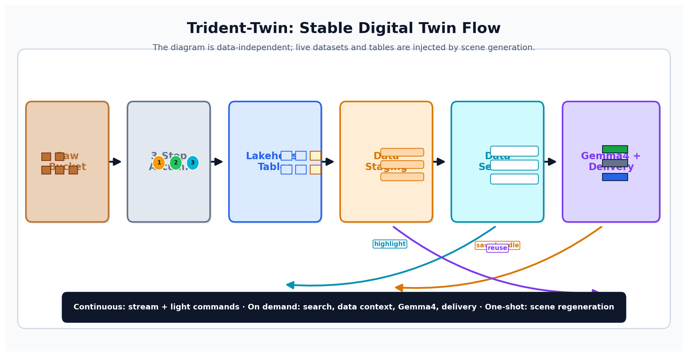
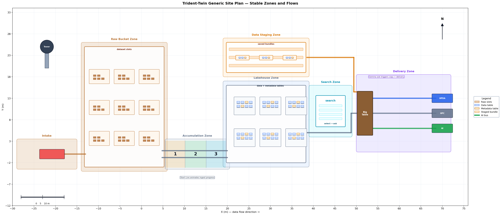
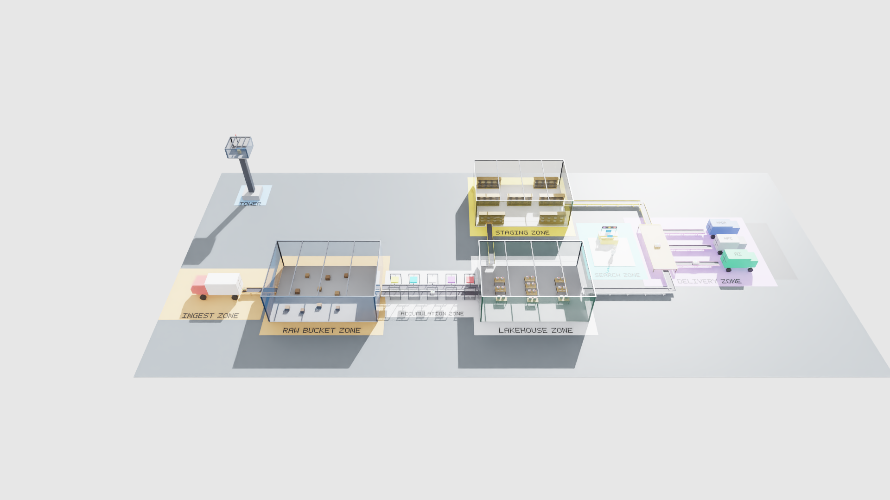
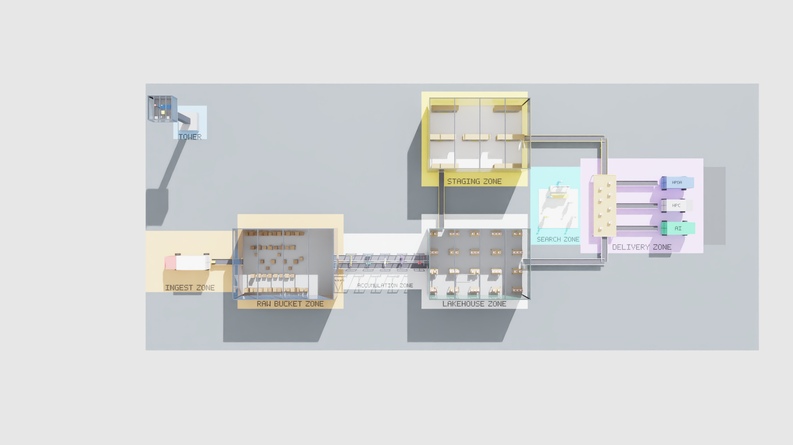

# Trident-Twin

**NVIDIA Omniverse/Isaac Sim 기반 Trident Lakehouse Digital Twin PoC (v11.1)**



> Conceptual Overview — Trident Lakehouse를 항만·창고·진열대·고객 응대로 비유한 개념도.
> Lake(트럭 유입) → Accumulation(컨베이어 위 메타 부여) → Lakehouse 진열대(Staging) → Adaptive Workload Interfaces(카트로 픽업하는 Delivery) → Operator(관제탑) 흐름을 보여준다.



> v11.1 Site Plan — 3-stage metallic 모델을 정확한 좌표 위에 매핑한 기술 평면도(탑뷰, X-Y).
> Bronze(Raw) → Silver(Pipeline + Lakehouse) → Gold(Showcase) → Big Consolidation Table → 3 dock trucks.
> 좌표는 `scripts/create_scene.py`의 USD stage와 1:1 일치 (1 unit = 1 m).
> 재생성: `python3 scripts/draw_site_plan.py`



> 실제 Isaac Sim RTX 렌더 (45° 부감) — v11.1 facility 전체 조감.
> 좌측 Ingest / Raw Bucket(🟫 Bronze) → 중앙 Accumulation / Lakehouse(🟦 Silver) → 상단 Staging / Showcase(🟨 Gold) → 우측 Search · Delivery, 좌상단 Control Tower.



> 동일 씬 90° 탑다운 RTX 렌더 — 위 Site Plan과 같은 탑뷰 구도로 8개 zone 배치를 한눈에 보여준다.

---

## Concept — Bronze → Silver → Gold metallic lifecycle

> 핵심 통찰: **데이터의 lifecycle 단계는 금속 톤으로 일관되게 표현된다.**
> 각 stage zone의 바닥 패드와 해당 stage로 들어가는 컨베이어 벨트 프레임이 동일한 메탈 컬러를 공유한다.

```
┌──────────────────────────────────────────────────────────────────────────────┐
│                            Trident Lakehouse Facility                        │
│                                                                              │
│   🟫 Bronze            🟦 Silver                       🟨 Gold                │
│   ────────             ──────────                     ──────                  │
│   Raw Bucket   →   Pipeline + Lakehouse        →    Showcase                  │
│   (Data Swamp)     (정제 + 라벨링 + 정식 보관)        (자주 쓰는 핫 데이터)      │
│                                                                              │
│                                                              ↓               │
│                                                       Big Consolidation Table │
│                                                              ↓               │
│                                                       AI · HPC · HPDA dock    │
└──────────────────────────────────────────────────────────────────────────────┘
```

| Stage | 색 | 공간 | 데이터 상태 | 책임 컴포넌트 |
|------|---|-------|----------|-----------|
| 🟫 **Bronze** | 브론즈 | Raw Bucket 창고 | 메타데이터 없는 갈색 무지 박스 (Data Swamp 표현) | Ceph S3 Raw Bucket |
| 🟦 **Silver** | 실버 | Pipeline + Lakehouse | Iceberg 포장 + 보라 라벨 + 빨강 카드 + 상태 LED, storage table에 적재 | Iceberg + Nessie + Milvus + Redis + PostgreSQL catalog |
| 🟨 **Gold** | 골드 | Showcase | 거실형 글래스 캐비닛에 핫 데이터 진열 | Redis hot key, Dataset Basket, access_audit |

---

## Overview

`Trident-Twin`은 v11.1 layout을 **3D 공간 + 상태 전이 + 이벤트 replay**로 표현하는 PoC이다.

- **공간**: 각 zone과 entity를 USD prim으로 배치 (Site Plan과 1:1)
- **상태**: 각 prim에 `trident:*` custom attribute로 현재 상태(stage/zone/metadata_status/sharing_status/last_event 등)를 기록
- **흐름**: Dataset Package가 Raw → Pipeline → Lakehouse → (Promotion) → Showcase → Big Table → Truck을 거치는 lifecycle을 mock event로 재생 (향후 Stats Service / twin-hub 실 source로 교체)
- **렌더**: Isaac Sim Kit extension이 상태 변화를 USD 속성에 반영, WebRTC로 Trident Portal에 스트리밍

핵심 분담:
- **Omniverse / Isaac Sim**: 3D 공간, USD prim, 상태 시각화, 이벤트 replay
- **Trident Lakehouse**: Iceberg / Nessie 기반 실 저장·카탈로그 계층 (state source of truth)
- **Metadata Layer**: Milvus(설명 메타) + Redis(공유 / 위치 메타) + PostgreSQL(거버넌스)
- **Portal / Stats Service / twin-hub**: 운영자 UI, 상태 API, WebRTC viewer
- **AI Agent / RAG**: Phase 5 비목표 — Intelligence Layer로 분리, 본 repo는 관측만

---

## v11.1 Layout — 8 zones

각 zone은 바닥에 칠해진 라벨(예: `INGEST ZONE`, `RAW BUCKET ZONE`)로 식별되며, 동일한 8개 구역이 `Top_*` 캡처 카메라와 `docs/screenshots/`의 탑뷰 컷과 1:1 대응한다.

| # | Zone (바닥 라벨) | 공간 / 역할 | 중심 (x, y) | 크기 | Stage |
| --- | --- | --- | --- | --- | --- |
| 1 | **INGEST** | Inbound Truck Yard + Bronze 인입 컨베이어 | (-22, 0) | asphalt 14×8 / pad 16×11 | 🟫 Bronze 진입 |
| 2 | **RAW BUCKET** | Bronze 창고 (Data Swamp) | (-4, 0) | 17×12×6 | 🟫 Bronze |
| 3 | **ACCUMULATION** | 5-station 파이프라인 (Main + Express 병렬) | (+13, 0) | pad 16×10, stations X=7/10/13/16/19 | 🟦 Silver 가공 |
| 4 | **LAKEHOUSE** | Silver 저장 창고 (5×4 = 20 테이블) | (+29, 0) | 17×12×6 | 🟦 Silver |
| 5 | **STAGING** | Showcase / Gold 진열장 (거실형 캐비닛 7개) | (+29, +22) | 17×12×6 | 🟨 Gold |
| 6 | **SEARCH** | Lobby + Search Counter 통합 plaza | (+44, +10) | plaza 10×14 | 질의 접수 |
| 7 | **DELIVERY** | Big Consolidation Table + AI/HPC/HPDA 트럭 3대 | (+59, +10) | asphalt 22×17, table 4×11 | 출고 / 서빙 |
| 8 | **TOWER** | Twin Control Tower (운영자) | (-22, +25) | 3.2×3.2 base + 9m shaft + glass deck + 안테나 | 관제 |

> **v11 → v11.1 변경점**:
> - Zone 0 Lobby와 Zone 7 Search Counter를 단일 **SEARCH plaza**로 통합 → 기능 구역이 10개에서 **8개**로 정리됨.
> - **Twin Control Tower가 남서쪽 (-22, -13)에서 북쪽 (-22, +25)로 이동** (Ingest Yard 위 공간 확보).
> - Pipeline 메인/익스프레스 벨트 Y 위치 정리(Main Y=-0.7 / Express Y=+0.7) 및 Promotion 벨트를 X=23으로 서쪽 이동(STAGING 라벨 가림 방지).
> - 존별 90° 탑다운 캡처 카메라 9개(`Top_*`)와 바닥 라벨/트럭 상단 라벨 추가.
> - 원본 설계의 Zone 3.5 Audit Gate와 Zone 6 Catalog Office는 제거됨 (생성 함수는 코드에 남아 있으나 `main()`에서 호출하지 않음).

---

## v11.1 Conveyor System — 색상으로 lifecycle 단계 표현

| 컨베이어 | Frame 색 | 경로 | 의미 |
| --- | --- | --- | --- |
| Inbound | 🟫 Bronze | Truck rear (-17.9) → Raw west (-12.3), Y=0 | Bronze 단계 진입 |
| Pipeline Main | 🟦 Silver | X (+4.7 → +20.4) at Y=-0.7 | Full Mode 5-station 풀 코스 |
| Pipeline Express | 🟦 Silver | X (+4.7 → +20.4) at Y=+0.7 | Delta Mode 평행 라인 (별도 belt 텍스처) |
| Converge Y-bends | 🟦 Silver | Main(Y -0.7→0) + Express(Y 0→+0.7) at X=+20.4 | Y=0 합류 → Lakehouse 진입 |
| Promotion | 🟨 Gold | X=+23, Y (+6 → +16) | LH → Showcase 핫 승격 |
| LH → Big Table | 🟦 Silver | X (+37.5 → +52) at Y=0 + Y bend (0 → +4.5) | Silver 출고 |
| SC → Big Table | 🟨 Gold | X (+37.5 → +52) at Y=+22 + Y bend (+15.5 → +22) | Gold 출고 |
| Big Table → AI dock | 🟪 Delivery | X (+54 → +61.5) at Y=+6 | 직선 dispatch |
| Big Table → HPC dock | 🟪 Delivery | X (+54 → +61.5) at Y=+10 | 직선 dispatch |
| Big Table → HPDA dock | 🟪 Delivery | X (+54 → +61.5) at Y=+14 | 직선 dispatch |

---

## Capture Cameras

USD stage에는 두 종류의 카메라가 정의되어 있다.

### 존별 90° 탑다운 캡처 카메라 (`/World/Cameras/Top_*`, 9개)

각 zone 중심 위에서 수직으로 내려다보는 카메라. `docs/screenshots/`의 탑뷰 컷과 동일한 프레이밍이다.

```text
Top_Overview     ( 15, +7, 95)  f14    # 전체 facility 조감
Top_Ingest       (-22,  0, 22)  f22
Top_RawBucket    ( -4,  0, 28)  f22
Top_Accumulation (+13,  0, 22)  f20
Top_Lakehouse    (+29,  0, 28)  f22
Top_Staging      (+29,+22, 28)  f22    # Showcase / Gold
Top_Search       (+44,+10, 22)  f22
Top_Delivery     (+59,+10, 30)  f22
Top_Tower        (-22,+25, 22)  f22    # Control Tower
```

### 시네마틱 카메라 (4개)

```text
Camera            전체 facility 조감 (perspective)
Camera_Pipeline   Pipeline + 5 stations 클로즈업
Camera_Storage    Lakehouse / Showcase 클로즈업
Camera_Delivery   Big Table + 3 truck 도크 클로즈업
```

---

## Current Status

현재 저장소에는 **실제로 Isaac Sim Python으로 생성 가능한 v11.1 USD stage**와 **mock event replay script**, 그리고 **twin-hub FastAPI 어댑터 스켈레톤**이 포함되어 있다.

완료된 항목:
- v11.1 Trident Lakehouse Twin USD scene 생성 (Bronze / Silver / Gold 메탈 테마, 8 zone)
- 3 separate buildings (Raw / Lakehouse / Showcase)
- 5-station pipeline with parallel Main + Express belts
- Big Consolidation Table + 3 straight outgoing belts
- Lobby + Search Counter 통합 SEARCH plaza
- 거실형 Showcase 캐비닛 7개 (북벽 2 + 중간 3 + 남벽 2)
- Lakehouse storage table 그리드 (5×4 = 20 tables)
- 5 user mannequin (admin/researcher/operator/viewer/librarian)
- 북쪽으로 이동한 Twin Control Tower (9m shaft + glass deck + 안테나)
- 바닥 zone 라벨 + 트럭 상단 라벨 (5×7 pixel alphabet)
- 존별 90° 탑다운 캡처 카메라 9개 (`Top_*`) + 시네마틱 카메라 4개
- mock event 기반 dataset lifecycle replay (10 events)
- USD custom attributes에 `trident:*` 상태 정보 기록
- Isaac Sim / Omniverse Kit extension skeleton
- twin-hub FastAPI read-only 어댑터 스켈레톤 (PoC fixture 서빙)

아직 남은 항목:
- twin-hub 실 source 바인딩 (Nessie / PostgreSQL / Redis / Milvus / stats-service)
- file_registry 바이패스 시각화
- Delta Mode 박스 변형 (작은 큐브)
- Integrity Audit Gate 재추가 (검토 중)
- Keycloak 실시간 아바타 (게이트 통과, 권한 거부)
- 박스 부유 이동 애니메이션 (search → counter → dock)
- 워크로드별 박스 변형 (AI 두루마리, HPC 폴더, HPDA 가상 테이블)
- Lakehouse 풀 lineage 광선 네트워크
- Portal WebRTC 동기화 (Twin Control Tower 안 모니터)
- Stats Service / WebSocket / API 실시간 연동

---

## Repository Contents

| Path | Description |
| --- | --- |
| `README.md` | 본 문서 (v11.1 기준) |
| `overview.png` | Conceptual Overview 일러스트 (수작업, 항만·창고 비유) |
| `docs/site-plan.png` | v11.1 Site Plan (탑뷰) |
| `docs/elevation.png` | Elevation View (사이드뷰) |
| `docs/screenshots/00_overview.png … 08_tower.png` | 존별 탑다운 스키매틱 9컷 (overview + 8 zones) |
| `docs/v10-design.md` | v10 시점 design diff 문서 |
| `docs/master-plan.md` | 초기 master-plan (참고용, 일부 내용은 v11.1에서 변경됨) |
| `data/twin_entities.json` | Twin entity 정의 |
| `data/mock_twin_events.json` | Dataset lifecycle mock event sequence (v11.1 좌표) |
| `scripts/create_scene.py` | Isaac Sim Python 기반 v11.1 USD stage 생성 스크립트 (단일 진실 소스) |
| `scripts/replay_events.py` | mock event를 USD time samples/custom attributes로 반영하는 replay 스크립트 |
| `scripts/add_cameras.py` | 기존 stage에 카메라를 추가하는 유틸리티 |
| `scripts/draw_site_plan.py` | `docs/site-plan.png` 생성 (matplotlib) |
| `scripts/draw_elevation.py` | `docs/elevation.png` 생성 (matplotlib) |
| `scripts/render_topdown.py` | `Top_*` 카메라 9개를 Isaac Sim에서 실제 RTX 렌더 → `docs/screenshots/Top_*.png` |
| `scripts/render_topdown_diagrams.py` | 존별 탑다운 스키매틱(matplotlib) → `docs/screenshots/00…08*.png` |
| `stages/trident_lakehouse_twin.usda` | v11.1 Trident Lakehouse Twin USD stage |
| `stages/trident_lakehouse_twin_replay.usda` | 이벤트 replay가 반영된 USD stage |
| `exts/trident.twin/` | Omniverse Kit / Isaac Sim extension skeleton |
| `twin-hub/` | Trident Lakehouse live state를 Kit extension에 노출하는 FastAPI 어댑터 (Phase 5) |

---

## Dataset Event Replay

`data/mock_twin_events.json`에는 데이터셋 하나의 v11.1 lifecycle 시나리오가 들어 있다.

```text
raw_arrived              (t=0,   -17.5, 0)   # 트레일러 후미
stored_in_lake           (t=20,  -4, 0)      # Raw 창고 내부
explaining_metadata_generated  (t=55,  16, -0.7)  # Milvus 스테이션
sharing_metadata_published     (t=75,  19, -0.7)  # Redis 스테이션
staged_in_lakehouse      (t=105, 29, 0)      # Lakehouse 테이블
customer_query_received  (t=118, 44, 13)     # SEARCH plaza
promoted_to_showcase     (t=128, 29, 22)     # Showcase 캐비닛
arrived_on_big_table     (t=138, 52, 10)     # Big Consolidation Table
delivered_to_ai_dock     (t=146, 61, 6)      # AI dock 직선 belt
served_to_workload       (t=150, 64, 6)      # AI 트럭 적재
```

각 이벤트는 USD stage에 다음 정보를 반영한다.
- Dataset Package의 위치 이동
- `trident:stage`, `trident:zone`, `trident:metadata_status`, `trident:sharing_status`, `trident:last_event` 갱신
- time sample 기반 replay 가능성 확보

---

## Trident Custom Attributes

```text
trident:entity_id = dataset.sample.001
trident:entity_type = dataset
trident:stage = staged_in_lakehouse
trident:zone = lakehouse.silver
trident:metadata_status = explaining_ready
trident:sharing_status = published
trident:quality_score = 0.92
trident:access_frequency = 17
trident:last_event = served_to_workload
```

`trident:entity_id`를 기준으로 향후 실제 source 연결:

```text
Redis      → file location, serving state, cache state
Milvus     → explaining metadata, dataset semantic context
PostgreSQL → governance, catalog, lineage, access policy
Iceberg    → table/snapshot/manifest state
Nessie     → branch/tag/commit metadata
Stats API  → event stream, health score, execution profile
```

---

## Quick Start

### 1. v11.1 Stage 생성

Isaac Sim Python을 사용해야 한다. 일반 Python에서는 `pxr` 모듈이 바로 잡히지 않는다.

```bash
cd /home/chang/git/Trident-Twin

/home/chang/isaac-sim/python.sh scripts/create_scene.py
/home/chang/isaac-sim/python.sh scripts/replay_events.py
```

생성 결과:

```text
stages/trident_lakehouse_twin.usda          (~660 KB)
stages/trident_lakehouse_twin_replay.usda   (~660 KB)
```

### 2. Isaac Sim에서 확인

Isaac Sim GUI 실행 후 아래 파일을 연다.

```text
File → Open → /home/chang/git/Trident-Twin/stages/trident_lakehouse_twin_replay.usda
```

좌측 상단 viewport 카메라 드롭다운에서 시네마틱 카메라 4개(`Camera`, `Camera_Pipeline`, `Camera_Storage`, `Camera_Delivery`) 또는 존별 탑다운 카메라 9개(`Top_*`)를 선택할 수 있다.

### 3. 탑다운 렌더 / 다이어그램 재생성

```bash
cd /home/chang/git/Trident-Twin

# 존별 탑다운 실제 RTX 렌더 (Isaac Sim) → docs/screenshots/Top_*.png
/home/chang/isaac-sim/python.sh scripts/render_topdown.py

# 존별 탑다운 스키매틱 (matplotlib) → docs/screenshots/00…08*.png
python3 scripts/render_topdown_diagrams.py

# Site Plan / Elevation 다이어그램
python3 scripts/draw_site_plan.py
python3 scripts/draw_elevation.py
```

### 4. twin-hub 실행 (Phase 5 stub)

```bash
cd /home/chang/git/Trident-Twin/twin-hub
uvicorn app:app --reload --port 8765
```

### 5. 기본 검증

```bash
cd /home/chang/git/Trident-Twin

python3 -m json.tool data/twin_entities.json >/dev/null
python3 -m json.tool data/mock_twin_events.json >/dev/null
python3 -m py_compile scripts/create_scene.py scripts/replay_events.py exts/trident.twin/trident/twin/extension.py
test -s stages/trident_lakehouse_twin.usda
test -s stages/trident_lakehouse_twin_replay.usda
```

---

## twin-hub — Live State Adapter (Phase 5)

`twin-hub/`는 Trident Lakehouse의 실시간 상태를 Omniverse Kit extension에 노출하는 **read-only** FastAPI 어댑터다. PoC fixture(`data/twin_entities.json`, `data/mock_twin_events.json`)와 동일한 스키마를 HTTP/WS 계약으로 제공한다.

| Method | Path | Returns |
| --- | --- | --- |
| GET | `/api/twin/entities` | `data/twin_entities.json`과 동일한 형태 |
| GET | `/api/twin/state` | entity별 `trident:*` 속성 스냅샷 |
| GET | `/api/twin/events?since=<ts>` | append-only event (mock event timeline 스키마) |
| WS | `/api/twin/stream` | 상태 diff push |
| GET | `/api/twin/health` | liveness probe |

- **control plane이 아님**: 실행/예측/tier 계획 없음, 관측만.
- **stub mode**: upstream source가 없으면 PoC fixture를 그대로 서빙해 Kit extension이 end-to-end로 계속 동작.
- **planned source bindings**: Nessie REST, PostgreSQL `catalog.*`, Redis SCAN, Milvus collection stats, Trident-Portal stats-service.

---

## Omniverse Extension Skeleton

Extension 경로:

```text
exts/trident.twin/
```

현재 목적:
- Isaac Sim / Kit extension 구조 확보
- mock event를 읽어 Dataset Package 상태를 갱신하는 기반 마련
- 향후 API / WebSocket 기반 live update로 확장

향후 목표:

```text
twin-hub /api/twin/entities
twin-hub /api/twin/events
twin-hub /api/twin/stream (WebSocket)
Portal selection ↔ Omniverse Prim selection
Omniverse WebRTC viewer ↔ Trident Portal
```

---

## Target Architecture

```text
[Trident Portal]
  ├─ Twin Viewer / WebRTC
  ├─ Dataset Detail Panel
  ├─ Event Timeline
  └─ Operator Actions
          │
          ▼
[Stats Service / twin-hub / Twin API]
  ├─ /api/twin/entities
  ├─ /api/twin/state
  ├─ /api/twin/events
  ├─ /api/twin/stream
  └─ /api/twin/health
          │
          ├──────────────► PostgreSQL
          │                 ├─ catalog / governance
          │                 ├─ lineage
          │                 └─ execution profiles
          │
          ├──────────────► Redis
          │                 ├─ location metadata
          │                 ├─ serving state
          │                 └─ cache freshness
          │
          ├──────────────► Milvus
          │                 └─ explaining metadata / vector context
          │
          ├──────────────► Iceberg / Nessie
          │                 ├─ table snapshots
          │                 ├─ manifests
          │                 └─ branches / tags
          │
          └──────────────► NVIDIA Omniverse / Isaac Sim
                            ├─ USD scene hierarchy
                            ├─ dataset state visualization
                            ├─ event replay
                            └─ operator interaction
```

---

## Roadmap

### Phase 1. Static Twin Scene (완료)
- v11.1 USD stage hierarchy 구성 (8 zone)
- Bronze / Silver / Gold 메탈 테마 적용
- 3 separate buildings, 5-station pipeline, Big Table
- Dataset Package와 metadata tag 표현
- 기본 카메라 / 조명 / 재질 구성

### Phase 2. Event Replay Twin (완료)
- mock event sequence 정의 (10 events)
- Dataset lifecycle animation 반영
- `trident:*` custom attributes 기록
- 이벤트 timeline 기반 replay 확인

### Phase 3. Live State Twin
- twin-hub / Stats Service에 twin state API 추가
- WebSocket event stream 연결
- Redis / Milvus / PostgreSQL 상태를 Twin entity로 변환
- Isaac Sim extension에서 live update 수행

### Phase 4. Portal Integrated Twin
- `Trident-Portal`의 Twin viewer와 WebRTC 연결
- Portal dataset selection과 Omniverse Prim selection 동기화
- Event timeline, health score, metadata panel 제공
- 운영자 action을 API로 전달

### Phase 5. Predictive Twin
- 실행 이력 기반 resource tier simulation
- Bronze / Silver / Gold 실행 시나리오 비교
- AI Agent / RAG 기반 병목 예측
- compaction, cache warm-up, re-indexing 같은 운영 제안 생성

### Phase 6+. Keycloak Avatars & Lineage Network
- 실시간 사용자 아바타 (게이트 통과, 권한 거부 X 표시)
- Lakehouse 전체에 걸친 lineage 광선 네트워크
- 박스 부유 이동 애니메이션
- 워크로드별 박스 변형 (두루마리 / 폴더 / 가상 테이블)

---

## Integration with Other Repositories

| Repository | Role |
| --- | --- |
| `Trident-Portal` | Next.js 제어 포털, FastAPI stats-service, WebRTC Twin viewer, monitoring UI |
| `TwinX-Ops` | Kubernetes / ArgoCD GitOps 배포 매니페스트 |
| `Trident-Twin` | Omniverse / Isaac Sim Digital Twin, event replay, predictive simulation 구현 공간 |

---

## Design Principle

이 프로젝트에서 Omniverse는 source of truth가 아니다.

```text
Source of truth:
  Redis / Milvus / PostgreSQL / Iceberg / Nessie / Stats Service

Omniverse role:
  USD Prim hierarchy
  state visualization
  event replay
  simulation
  operator interaction
```

즉, 실제 데이터는 Lakehouse와 metadata backend에 있고, Omniverse는 그 상태를 **공간적으로 이해하고, 재생하고, 운영자가 상호작용할 수 있게 만드는 Twin layer**다.
