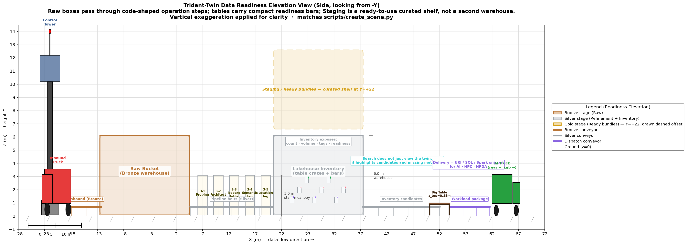

# Trident-Twin

**Data Readiness / Usage Optimization Twin for the Trident Lakehouse**

Trident-Twin is not just a 3D visualization of a lakehouse. Its target role is a
**spatial decision map** that helps Trident Portal users understand which data is
ready, why it is searchable, and how it can be delivered to AI / HPC / HPDA
workloads.


> Conceptual Overview — Trident-Twin reframed as a **Data Readiness / Usage
> Optimization Twin**. The value loop is `Raw intake` → `Refinement + metadata`
> → `Lakehouse Inventory` → `Ready Bundle staging` → `Search & workload use`.
> Users should be able to judge “what can I use right now?” from box type,
> count, metadata tags, readiness, and workload fit.


> Site Plan — the same coordinate system, but annotated around operational value:
> raw object count → refined table inventory with metadata/readiness tags →
> curated ready bundles → Search/Selection → AI/HPC/HPDA delivery.



> Elevation — raw boxes become table crates with metadata tags. Staging is not a
> second warehouse; it is a ready-to-use curated shelf above the Lakehouse
> Inventory flow.


> Top-down schematic overview — the 8 zones are now explained as a data readiness
> map. Legacy Isaac Sim RTX renders are kept only as physical-layout references
> under [Legacy render references](#legacy-render-references).

---

## Product thesis

The core question is not “can we render the lakehouse in 3D?” The core question
is:

> **Can the twin help users find usable data faster than a table/list UI alone?**

A useful Trident-Twin should answer these questions at a glance:

1. **What data exists?** — raw files, metadata files, Iceberg tables, derived collections.
2. **How much exists?** — object count, table count, rows, namespace/component density.
3. **How refined is it?** — schema readiness, Iceberg table state, quality score, lineage.
4. **Which metadata tags are attached?** — semantic, location/share, policy, freshness, cache.
5. **What is ready to use now?** — hot datasets, Dataset Basket items, recommended bundles, materialized collections.
6. **Where can it be used?** — AI / HPC / HPDA workload delivery packages and snippets.

This makes the twin an **operational decision interface**, not a decorative
viewer. The spatial layout exists to make readiness, missing metadata, hot
resources, and workload fit easier to compare.

---

## Concept model

```text
Raw Bucket
  → Refinement Pipeline
  → Lakehouse Inventory
      ├─ table crates by namespace / component
      ├─ metadata tags: quality, lineage, policy, semantic, location
      └─ usage heat / freshness / cache state
  → Staging / Ready Bundles
      ├─ hot datasets
      ├─ Dataset Basket candidates
      ├─ recommended joins / collections
      └─ workload-ready packages
  → Search & Workload Delivery
      ├─ highlight candidate data
      ├─ compare readiness
      ├─ explain missing tags / bottlenecks
      └─ deliver URI / SQL / Spark snippets to AI · HPC · HPDA
```

### Lakehouse Inventory vs Staging

Do **not** merge Lakehouse and Staging into one vague warehouse.

| Layer | Meaning | What users learn |
| --- | --- | --- |
| **Lakehouse Inventory** | Full refined data inventory; close to Iceberg/Nessie source of truth | What exists, how much exists, how it is organized, and what metadata is attached |
| **Staging / Ready Bundles** | Curated usage layer; Portal basket / hot collection / recommended combination / materialized collection | What is likely useful now, what can be selected quickly, and which workload it fits |

They may be physically close in the scene, but conceptually they must remain
separate: **Inventory shows all refined resources; Staging shows fast-use
candidates.**

---

## Visual grammar

The figures and future USD scene should use a stable vocabulary so users can
read the twin quickly.

| Visual object | Meaning | Quantity / density | Tags shown |
| --- | --- | --- | --- |
| Brown raw box | Source object without useful metadata | raw object count, namespace piles | source, size, arrival time |
| Silver table crate | Refined Iceberg table | table count, row/object volume, partition density | schema, quality, Nessie commit |
| Purple dot/tag | Milvus semantic metadata | embedding/vector coverage | topic, modality, similarity |
| Red dot/tag | Redis location/share metadata | URI count, cache hit/freshness | location, cache, published/private |
| Green badge | policy/readiness OK | readiness score / policy pass | allowed, quality passed, lineage tracked |
| Yellow/gold bundle | Staging ready-to-use candidate | basket size, access frequency | workload fit, confidence, last used |
| Workload cart/truck | AI/HPC/HPDA delivery package | delivery queue/state | URI, SQL, Spark snippet, owner |

This is the main value: “many boxes” should not be decoration. It should mean
resource volume, metadata coverage, readiness, or usage pressure.

---

## Data Readiness layout — 8 zones

| # | Zone | Role | Center (x, y) | Stage |
| --- | --- | --- | --- | --- |
| 1 | **INGEST** | Raw data arrives from inbound sources | (-22, 0) | Bronze intake |
| 2 | **RAW BUCKET** | Untagged source objects; quantity visible, metadata mostly missing | (-4, 0) | Bronze raw |
| 3 | **REFINEMENT PIPELINE** | Schema detection, Iceberg table creation, quality/lineage, semantic/location tags | (+13, 0) | Silver refinement |
| 4 | **LAKEHOUSE INVENTORY** | Refined tables grouped by namespace/component with count, volume, freshness, quality, tags | (+29, 0) | Silver inventory |
| 5 | **STAGING / READY BUNDLES** | Dataset Basket, hot datasets, recommended joins, materialized collections | (+29, +22) | Gold ready-to-use |
| 6 | **SEARCH / SELECTION** | User intent highlights candidates, compares readiness, explains missing metadata | (+44, +10) | Selection |
| 7 | **WORKLOAD DELIVERY** | Selected datasets/collections become AI/HPC/HPDA packages and snippets | (+59, +10) | Usage |
| 8 | **CONTROL TOWER** | Operator view of readiness, bottlenecks, and live state | (-22, +25) | Monitoring |

---

## Current usability

### Usable now

The repository is currently useful for:

- **Explaining the thesis** to a professor/reviewer: why the twin has value beyond visualization.
- **Showing a design direction** with concrete diagrams, not only text.
- **Demonstrating a PoC flow** from raw data to refined inventory to ready bundles to workload delivery.
- **Keeping an executable skeleton**: USD scene generation, mock event replay, and a stub `twin-hub` API.

### Not yet production-usable

It is **not yet** a real operational data-finding tool because these parts are
still missing or stubbed:

- live source bindings from Nessie / PostgreSQL / Redis / Milvus / stats-service;
- real table/object/row counts flowing into the scene;
- actual metadata tag coverage from Milvus/Redis/PostgreSQL;
- Portal search selection ↔ Omniverse prim highlight synchronization;
- ready bundle generation from real Dataset Basket / collection / access-frequency data;
- WebSocket stream from live Trident events;
- updated USD prim vocabulary matching the new diagram vocabulary.

### Practical verdict

**For presentation / design review: yes, this is usable.**

It now clearly shows the intended value: helping users quickly find, compare,
and use ready data.

**For real users operating Trident today: not yet.**

The next engineering step is to connect the visual grammar to real backend
signals so that boxes and tags are not hand-authored diagrams but live state.

---

## Implementation status

Completed in this repository:

- Data Readiness / Usage Optimization concept documented in `README.md`.
- Regenerated schematic figures:
  - `overview.png`
  - `docs/site-plan.png`
  - `docs/elevation.png`
  - `docs/screenshots/00_overview.png … 08_tower.png`
- Matplotlib diagram generators:
  - `scripts/draw_overview.py`
  - `scripts/draw_site_plan.py`
  - `scripts/draw_elevation.py`
  - `scripts/render_topdown_diagrams.py`
- Data Readiness USD prim vocabulary is now implemented in the scene generator:
  - `/World/DataReadiness/RawObjects/*`
  - `/World/DataReadiness/Inventory/*`
  - `/World/DataReadiness/ReadyBundles/*`
  - `/World/DataReadiness/SearchSelection/*`
  - `/World/DataReadiness/WorkloadDelivery/*`
- Fixture data and replay now carry readiness fields such as `semantic_ready`,
  `location_ready`, `policy_ready`, `readiness_score`, `workload_fit`,
  `selected_bundle`, and `delivery_package`.
- Existing Isaac Sim / USD PoC assets remain under `stages/`; regenerate them
  with Isaac Sim Python after pulling the latest generator changes.
- Existing `twin-hub` FastAPI stub now emits the expanded Data Readiness state
  contract while still serving fixtures.

Next implementation targets:

1. Regenerate `stages/trident_lakehouse_twin.usda` and
   `stages/trident_lakehouse_twin_replay.usda` inside the Isaac Sim container.
2. Add live inventory metrics to `twin-hub`: table count, row/object volume,
   freshness, quality, access frequency, cache state.
3. Bind `twin-hub` to real sources: Nessie, PostgreSQL catalog/governance,
   Redis, Milvus, and Trident Portal stats-service.
4. Add Portal ↔ Twin synchronization: search result selection highlights
   matching prims; selected bundles move to delivery.
5. Use WebSocket streaming for live state diffs.

---

## Repository contents

| Path | Description |
| --- | --- |
| `README.md` | Current product/design source of truth |
| `overview.png` | Data Readiness / Usage Optimization concept overview |
| `docs/site-plan.png` | Top-down data readiness site plan |
| `docs/elevation.png` | Side-view readiness elevation |
| `docs/screenshots/00_overview.png … 08_tower.png` | Zone-level schematic top-down diagrams |
| `scripts/draw_overview.py` | Generates `overview.png` |
| `scripts/draw_site_plan.py` | Generates `docs/site-plan.png` |
| `scripts/draw_elevation.py` | Generates `docs/elevation.png` |
| `scripts/render_topdown_diagrams.py` | Generates schematic zone PNGs |
| `scripts/create_scene.py` | Isaac Sim Python USD scene generator |
| `scripts/replay_events.py` | Applies mock event replay into USD |
| `data/twin_entities.json` | Fixture entity definitions |
| `data/mock_twin_events.json` | Fixture event timeline |
| `twin-hub/` | FastAPI read-only state adapter stub |
| `exts/trident.twin/` | Omniverse Kit extension skeleton |
| `stages/` | Generated USD stages |

---

## Regenerate diagrams

```bash
cd /home/chang/git/Trident-Twin

python3 scripts/draw_overview.py
python3 scripts/draw_site_plan.py
python3 scripts/draw_elevation.py
python3 scripts/render_topdown_diagrams.py
```

## Regenerate USD stage

Isaac Sim Python is required because normal Python usually does not provide
`pxr`/USD bindings.

```bash
cd /home/chang/git/Trident-Twin

/home/chang/isaac-sim/python.sh scripts/create_scene.py
/home/chang/isaac-sim/python.sh scripts/replay_events.py
```

Open the replay stage in Isaac Sim:

```text
File → Open → /home/chang/git/Trident-Twin/stages/trident_lakehouse_twin_replay.usda
```

## Run twin-hub stub

```bash
cd /home/chang/git/Trident-Twin/twin-hub
uvicorn app:app --reload --port 8765
```

Endpoints:

| Method | Path | Returns |
| --- | --- | --- |
| GET | `/api/twin/health` | liveness |
| GET | `/api/twin/entities` | fixture entity list |
| GET | `/api/twin/state` | latest `trident:*` state snapshot |
| GET | `/api/twin/events?since=<ts>` | event timeline filter |

---

## Verification

```bash
cd /home/chang/git/Trident-Twin

python3 -m json.tool data/twin_entities.json >/dev/null
python3 -m json.tool data/mock_twin_events.json >/dev/null
python3 -m py_compile \
  scripts/draw_overview.py \
  scripts/draw_site_plan.py \
  scripts/draw_elevation.py \
  scripts/render_topdown_diagrams.py \
  scripts/create_scene.py \
  scripts/replay_events.py \
  exts/trident.twin/trident/twin/extension.py
python3 twin-hub/test_stub.py
test -s stages/trident_lakehouse_twin.usda
test -s stages/trident_lakehouse_twin_replay.usda
```

---

## Integration with other repositories

| Repository | Role |
| --- | --- |
| `Trident-Portal` | Search, Dataset Basket, workload delivery, WebRTC viewer, stats-service |
| `TwinX-Ops` | Kubernetes / ArgoCD deployment source of truth |
| `Trident-Twin` | Data readiness twin, USD scene, event replay, live state projection |

---

## Design principle

Omniverse is not the source of truth.

```text
Source of truth:
  Iceberg / Nessie / Redis / Milvus / PostgreSQL / Stats Service / Portal

Twin role:
  spatial projection of readiness, metadata coverage, usage pressure,
  candidate bundles, bottlenecks, and workload delivery state
```

The twin becomes valuable only when it helps users make a faster and better data
selection decision.

---

## Legacy render references

The following images are retained as references for the current physical USD
layout, but they are no longer the primary explanation of the product value:

- `docs/screenshots/Obli_Overview.png`
- `docs/screenshots/Top_Overview.png`

They should be regenerated after the USD scene adopts the Data Readiness visual
grammar.
