# Trident-Twin

**Trident Lakehouse Digital Twin — Trident Portal `/digital-twin`에서 Raw Bucket → Lakehouse → Search/Gemma4 → Data Staging/Delivery 흐름을 보여주는 Isaac Sim 기반 Digital Twin**

마지막 업데이트: **2026-06-15**

Trident-Twin은 Trident Lakehouse를 단순히 3D로 전시하는 저장소가 아니다. Portal 사용자가 **어떤 raw dataset이 존재하고, 어떤 Lakehouse table로 materialize 됐고, 어떤 데이터 묶음을 검색/선택해서 Gemma4나 AI/HPC/HPDA workload로 넘길 수 있는지**를 공간적으로 확인하는 **read-mostly Digital Twin viewer + event bridge**이다.

현재 구현 기준 핵심은 다음과 같다.

- Portal **Digital Twin** 메뉴에서 Isaac Sim / Omniverse WebRTC stream을 임베드한다.
- 우측 `Digital Twin Control`에는 **Zone Camera**, **Data Search**, **Data Staging** 탭이 있다.
- **Zone Camera**는 authored USD camera preset으로 항상 재초기화되어, 사용자가 orbit한 뒤 다시 눌러도 고정된 camera view로 돌아간다.
- **Data Search**는 single/multi dataset 선택을 지원하고, 선택된 Lakehouse table을 점등한다.
- **Ask Gemma4 with Selection**을 누르면 선택 데이터의 bounded Lakehouse context를 수집해 Gemma4에 전달하고, 동시에 선택 데이터 copy가 Big Table → AI Bus 방향으로 이동하는 visual workload를 만든다.
- **Data Staging**은 Portal의 Dataset Basket처럼 이전에 질문했던 데이터 묶음을 저장/재사용한다. 저장된 bundle은 Staging Zone의 긴 display table 위에 나타나고, X로 삭제하면 scene에서도 사라진다.
- `twin-hub`는 Portal과 Isaac extension 사이의 HTTP command bridge다.
- scene 생성 시 Raw Bucket Zone과 Lakehouse Zone은 `twin-hub /api/twin/entities`의 live entity를 읽어 서로 맞춰 생성한다.
- 무거운 catalog/search/S3 조회는 계속 polling하지 않고, TTL cache 또는 사용자 click/submit 시점에만 수행한다.

명확한 non-goal:

- Omniverse가 catalog/storage/governance source of truth가 아니다.
- 폐루프 자동 제어(closed-loop control)를 완성한 시스템이라고 말하지 않는다.
- 모든 Portal event가 frame 단위 실시간 양방향 동기화된다고 과장하지 않는다.
- 검색, catalog, S3 전체 스캔을 짧은 주기로 계속 돌리지 않는다.

---

## 1. 2026-06-15 현재 운영 상태

| 항목 | 현재 값 |
| --- | --- |
| Portal image | `ich6648/trident-portal:v97.146` |
| twin-hub image | `ich6648/trident-twin-hub:v0.1.7` |
| GitOps 반영 | `SmartX-Team/TwinX-Ops` PR [#177](https://github.com/SmartX-Team/TwinX-Ops/pull/177) merged |
| Portal service | `http://10.38.38.217` |
| Portal → twin-hub | `http://trident-twin-hub.trident.svc.cluster.local:8765` |
| twin-hub LoadBalancer | `http://10.38.38.223:8765` |
| Portal → Isaac signaling | `10.38.38.197:49100` |
| Isaac container | `ssh netai@l40s`, Docker container `isaac-sim-ICH-strongest` |
| 최신 확인 scene | `/mnt/Trident-Twin-520d314/stages/trident_lakehouse_twin_20260615_1338.usda` |
| 최신 screenshot capture | 2026-06-15 07:53 UTC, `scripts/capture_overview.py` |
| 최신 stream log | `/tmp/trident-streaming-readme-20260615-075248.log` |

최근 검증:

- `python3 -m py_compile` for `scripts/*.py`, `twin-hub/app.py`, Isaac extension
- `python3 scripts/draw_overview.py`
- `python3 scripts/draw_site_plan.py`
- `python3 scripts/render_topdown_diagrams.py`
- l40s Isaac capture: latest USD 기준 actual scene screenshots 갱신
- l40s ICH stream restart: `[ext: trident.twin-0.1.0] startup`, `Isaac Sim Full Streaming App is loaded`
- Cluster rollout: `trident-portal:v97.146`, `trident-twin-hub:v0.1.7`
- Staging smoke: `POST /api/twin/staging` returns `kind=staging` command

---

## 2. 현재 그림 / screenshot

### 2.1 Product overview


### 2.2 Scene site plan / 설계도


### 2.3 실제 Isaac scene screenshots

| View | Screenshot |
| --- | --- |
| Overall 45° | 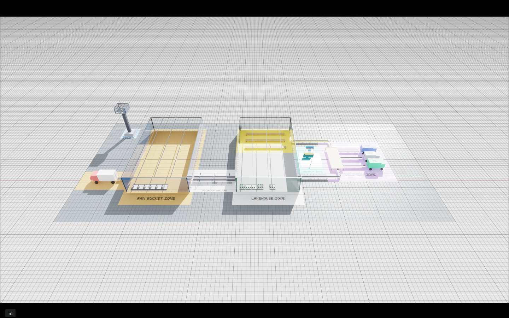 |
| Overall 90° | 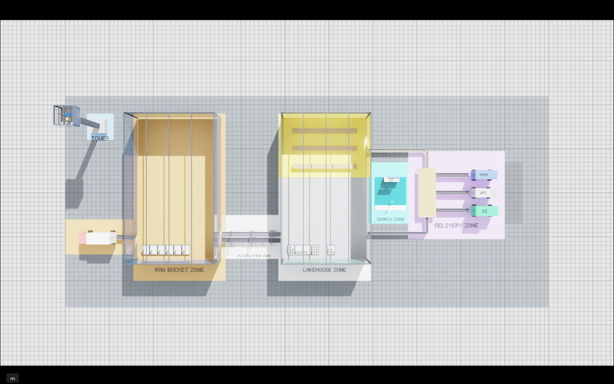 |
| Raw Bucket Zone | 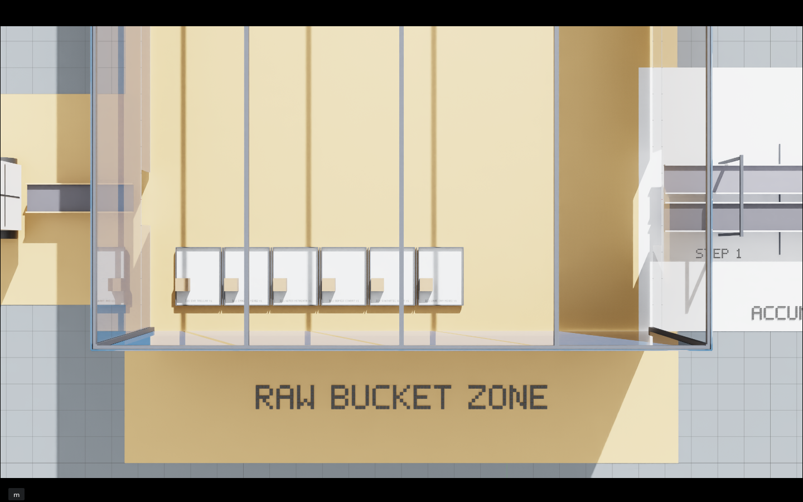 |
| Accumulation Zone | 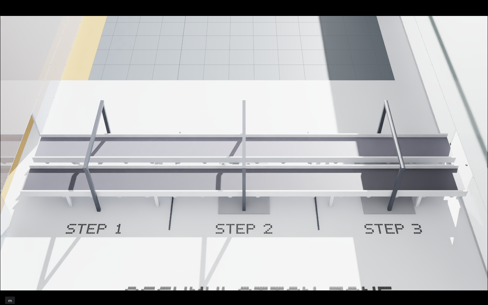 |
| Lakehouse Zone | 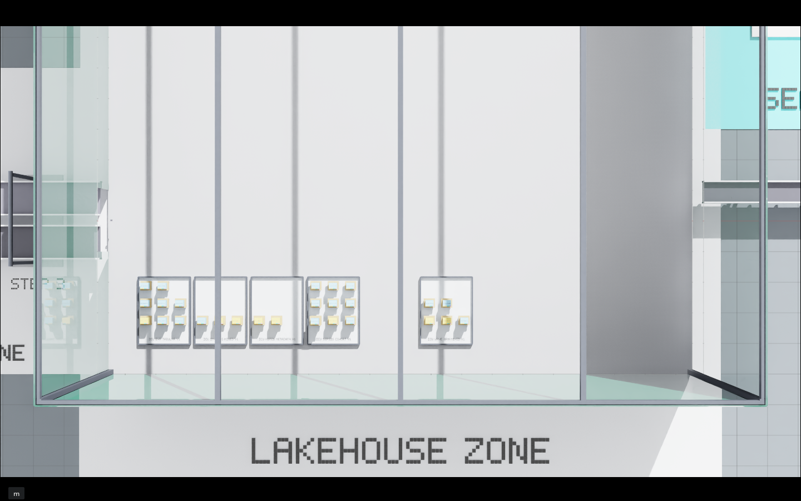 |
| Data Staging Zone | 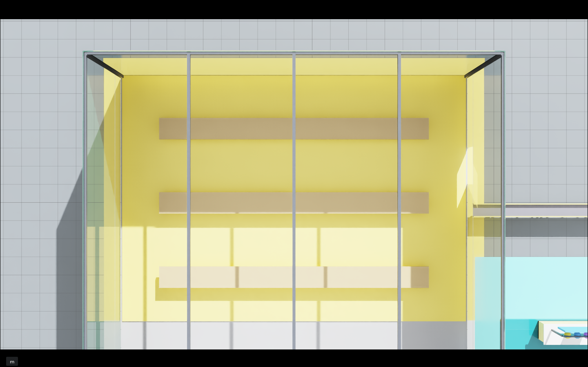 |
| Search Zone | 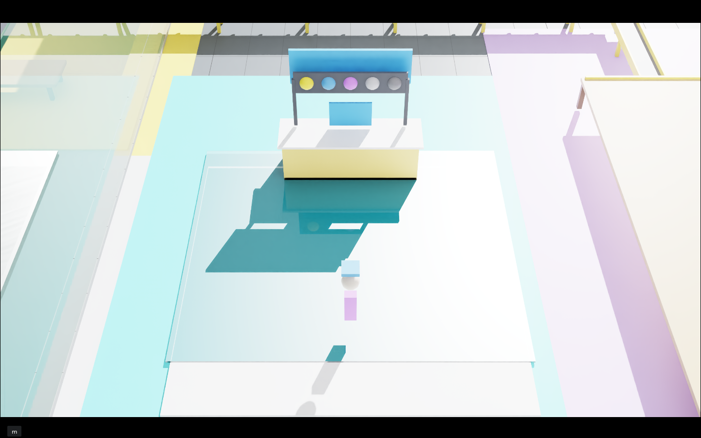 |
| Delivery Zone | 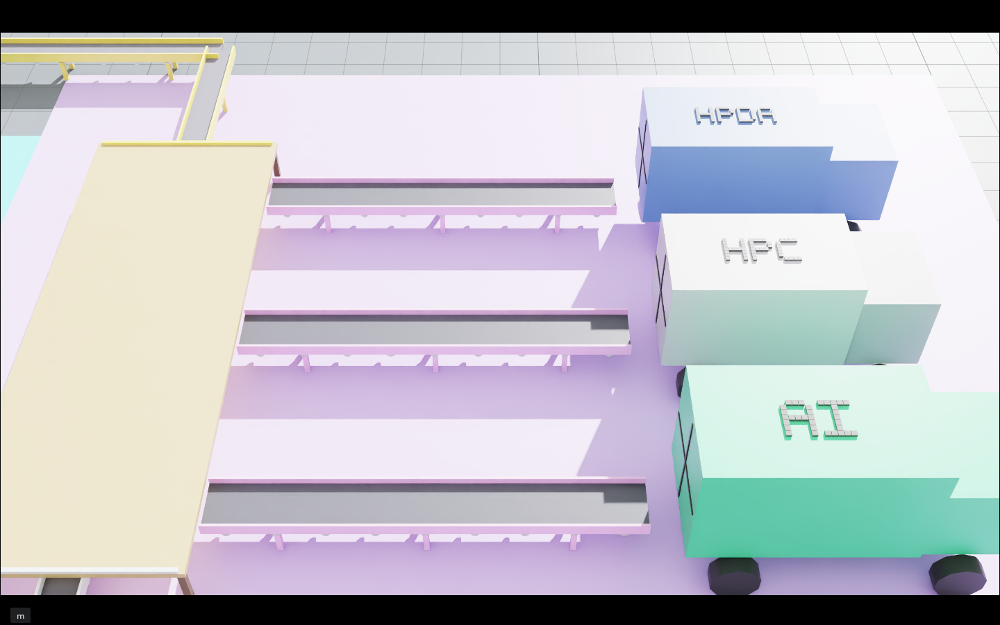 |
| Control Tower Zone | 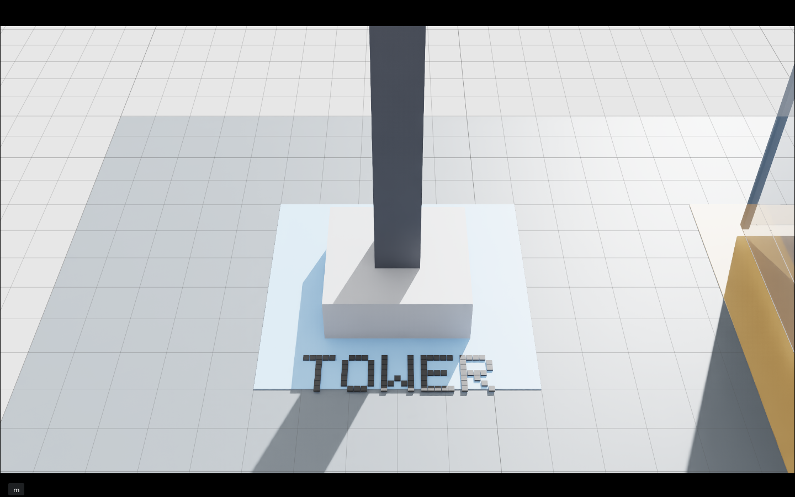 |

### 2.4 문서용 top-down zone diagrams

아래 이미지는 Isaac renderer capture가 아니라 README 설명용 schematic이다.

| Zone | Diagram |
| --- | --- |
| Overall | 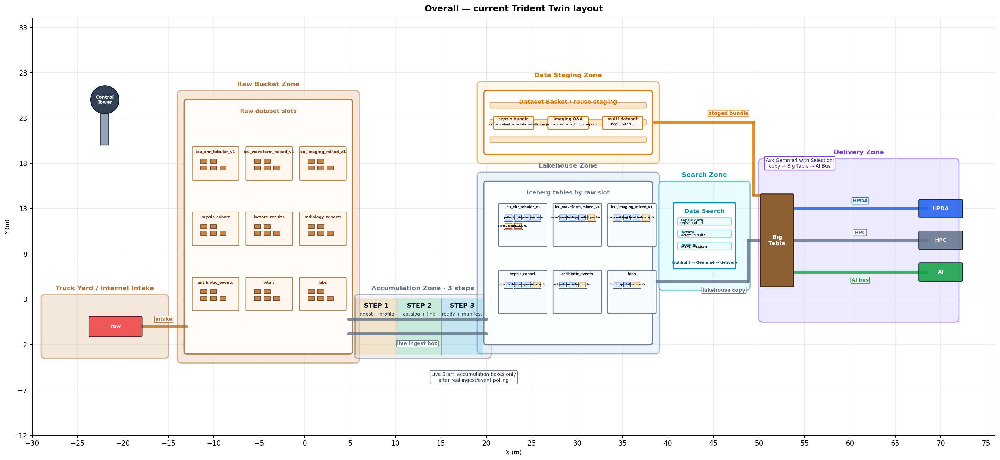 |
| Raw Bucket | 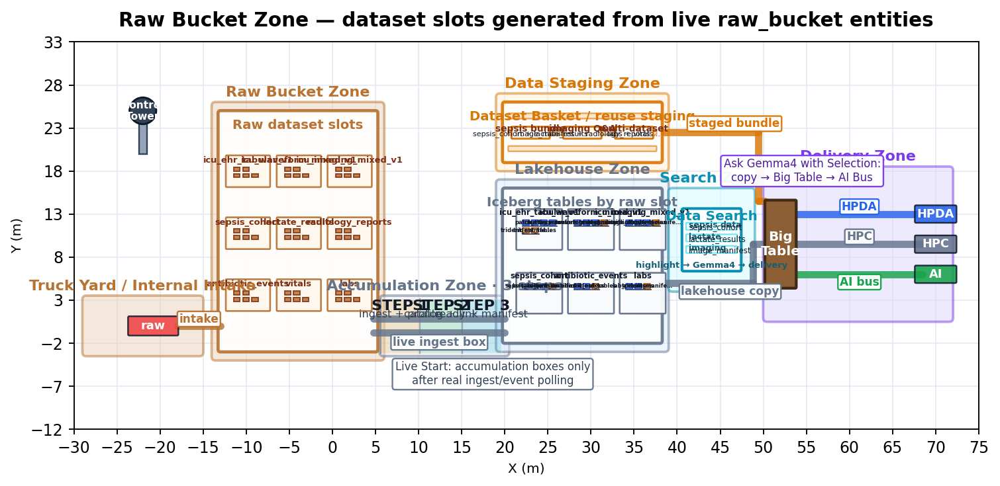 |
| Accumulation | 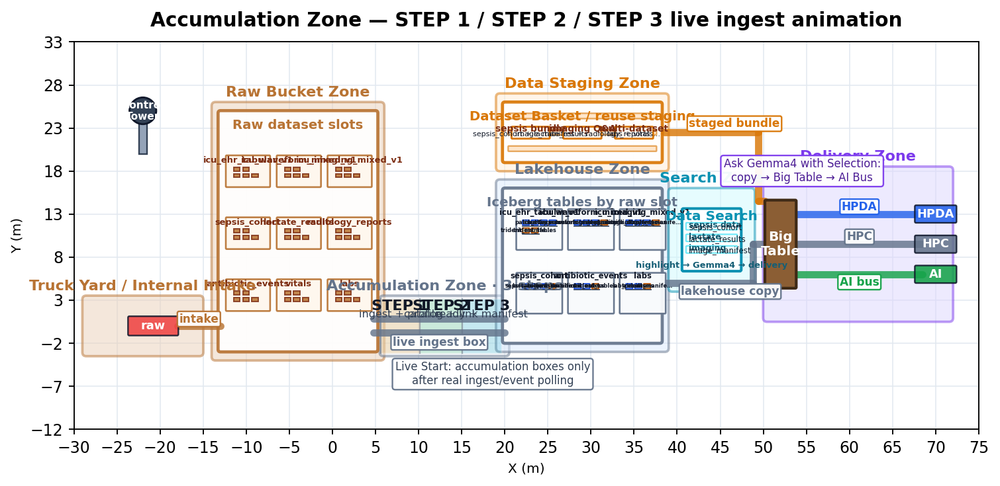 |
| Lakehouse | 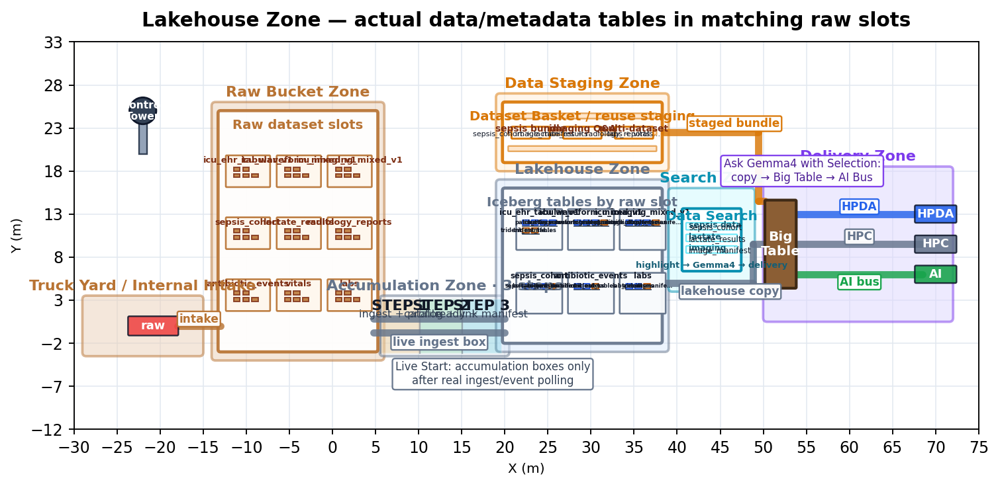 |
| Data Staging | 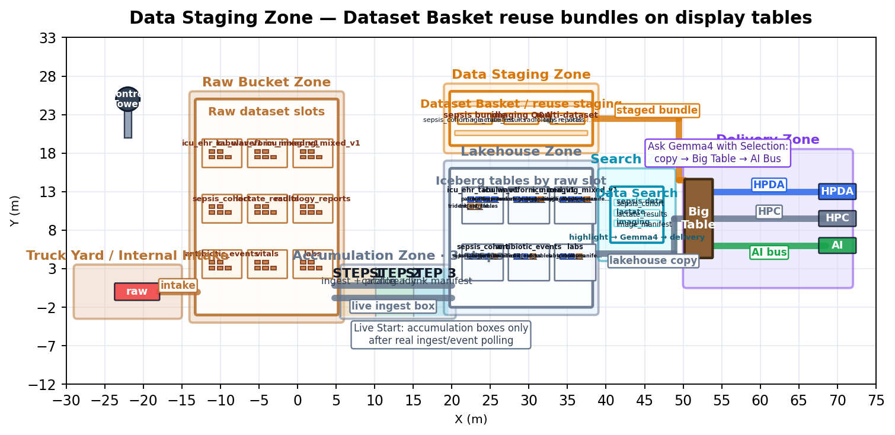 |
| Search | 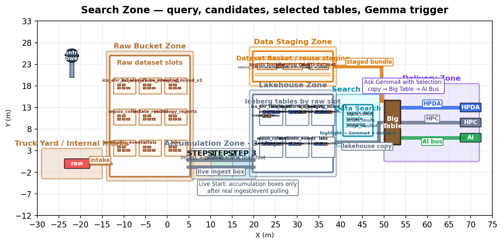 |
| Delivery | 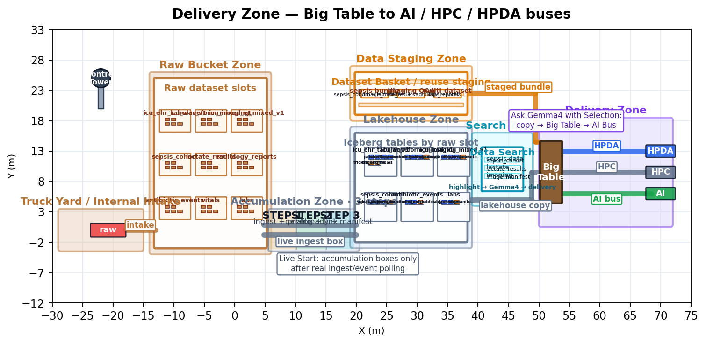 |
| Control Tower | 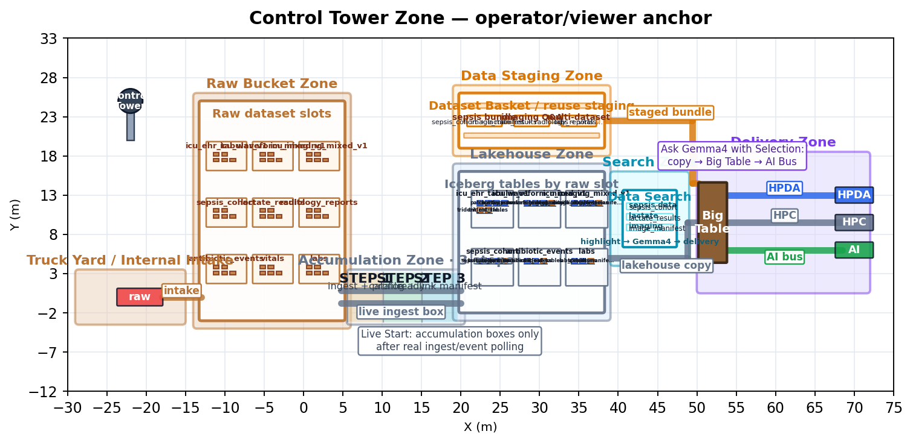 |

이미지 재생성:

```bash
python3 scripts/draw_overview.py
python3 scripts/draw_site_plan.py
python3 scripts/render_topdown_diagrams.py
```

실제 Isaac screenshot 재캡처는 Isaac Sim container 안에서 실행한다.

```bash
# ssh netai@l40s 이후, 또는 docker exec로 실행
cd /mnt/Trident-Twin-520d314
/isaac-sim/python.sh scripts/capture_overview.py
```

> 주의: actual capture는 Isaac renderer를 사용하므로 보통 ICH stream process를 잠깐 멈춘 뒤 실행하고, 캡처 후 stream을 다시 켠다. 다른 Isaac container/process는 건드리지 않는다.

---

## 3. 관련 저장소와 책임

| 저장소 | 실제 역할 | Trident-Twin과의 연결 |
| --- | --- | --- |
| [`SmartX-Team/TwinX-Ops`](https://github.com/SmartX-Team/TwinX-Ops) | 실제 클러스터 배포 ArgoCD/GitOps repo | `trident-portal`, `trident-twin-hub` image/env/source of truth. PR/merge로만 변경 |
| [`mj006648/Trident-Portal`](https://github.com/mj006648/Trident-Portal) | 실제 사용자 포탈 | `/digital-twin`, Isaac viewer, Zone Camera, Data Search, Data Staging, Gemma4 Q&A |
| [`mj006648/Trident-Lakehouse`](https://github.com/mj006648/Trident-Lakehouse) | 연구/논문/phase 정리 repo | Twin의 연구 주장 범위와 Lakehouse phase 정의 기준 |
| [`mj006648/Trident-Twin`](https://github.com/mj006648/Trident-Twin) | Digital Twin 구현 repo | USD scene generator, `twin-hub`, Isaac extension, live sync helper, README/images |

---

## 4. 전체 흐름

```text
Portal /digital-twin
  ├─ /api/digital-twin/config
  │    └─ ISAAC_SIM_HOST=10.38.38.197, ISAAC_SIM_SIGNALING_PORT=49100
  ├─ IsaacSimViewer
  │    └─ NVIDIA Omniverse WebRTC direct stream
  └─ Digital Twin Control
       ├─ Zone Camera
       │    └─ /api/digital-twin/camera → twin-hub /api/twin/camera
       ├─ Data Search
       │    ├─ Portal search API
       │    ├─ candidate select → /api/digital-twin/highlight → /api/twin/highlight
       │    └─ Ask Gemma4 with Selection
       │         ├─ collect bounded Lakehouse context
       │         ├─ /api/digital-twin/gemma/ask → Gemma4 vLLM
       │         ├─ /api/digital-twin/staging → /api/twin/staging
       │         └─ /api/digital-twin/delivery → /api/twin/delivery
       └─ Data Staging
            ├─ localStorage-backed staged bundles
            ├─ select bundle → highlight + staging select command
            └─ remove bundle → staging remove command

Isaac Sim / trident.twin extension
  ├─ command polling: twin-hub /api/twin/commands?since=<seq>
  ├─ optional live polling after Start Live: twin-hub /api/twin/entities
  └─ applies camera/highlight/staging/delivery/live boxes onto USD stage

Scene generation
  ├─ scripts/create_scene.py
  ├─ fetches twin-hub /api/twin/entities at generation time
  ├─ creates Raw Bucket dataset slots
  ├─ mirrors actual Lakehouse tables into matching Lakehouse slots
  └─ creates Search, Staging, Delivery, Control Tower zones
```

Source of truth 원칙:

```text
Lakehouse source of truth:
  Iceberg / Nessie / Redis / Milvus / PostgreSQL / stats-service / Portal

Twin 책임:
  viewer, zone camera, readiness visualization, search selection highlight,
  staged bundle display, selected data context handoff to Gemma4, workload animation
```

---

## 5. 계속 연동할 것 vs 한 번만 연동할 것

랙을 줄이기 위해 연동을 세 종류로 분리한다.

| 구분 | 계속 유지 | click/submit 시점 | 일회성/명시적 작업 |
| --- | --- | --- | --- |
| WebRTC stream | Portal Digital Twin 탭이 열려 있을 때 Isaac stream 유지 | 해당 없음 | stale stream이면 ICH stream process만 재시작 |
| Camera | Isaac extension이 command queue를 가볍게 polling | Zone Camera 클릭 시 camera command 1건 생성 | camera preset 추가/삭제는 code + image + GitOps PR |
| Viewer state | Portal 사용자가 Digital Twin에 들어오면 active viewer 1명 표시 | login/session 변경 시 viewer_state command | role/color 정책 변경 시 Portal/twin-hub 수정 |
| Data Search | 자동 polling 없음 | 사용자가 Search 버튼을 누를 때 Portal search API 호출 | 검색 schema 변경 시 Portal adapter 수정 |
| Search highlight | 계속 polling하지 않음 | candidate 선택 시 highlight command 생성 | USD entity id contract 변경 시 scene 재생성 |
| Data Staging | 브라우저 localStorage에 bundle 목록 유지 | Ask 성공/선택/삭제 시 staging command 생성 | Staging Zone layout 변경 시 scene 재생성 |
| Gemma4 Q&A | 자동 호출 없음 | 선택 데이터 + 질문 제출 시 bounded data context 수집 후 vLLM 호출 | 모델/endpoint 변경은 TwinX-Ops env 수정 |
| Delivery animation | 계속 이동시키지 않음 | Gemma ask 또는 staging reuse 시 copy package를 Big Table/AI Bus로 이동 | visual route 변경 시 extension 수정 |
| Raw/Lakehouse scene | scene 생성 시 live entity를 1회 조회 | 해당 없음 | raw bucket/table 구조가 크게 바뀌면 USD 재생성 |
| Accumulation live boxes | extension `Start Live` 이후에만 `/api/twin/entities` polling | active ingest event를 3-step 구간으로 표시 | 기본 static scene 자체는 scene generation으로 관리 |
| stats-service catalog/S3 | `twin-hub` TTL cache로 보호 | 필요 시 API request | frame 단위/짧은 주기 전체 스캔 금지 |

---

## 6. Portal Digital Twin UX contract

Portal 쪽 주요 파일:

| Portal 파일 | 역할 |
| --- | --- |
| `src/app/(app)/digital-twin/page.tsx` | viewer + right panel. `Zone Camera`, `Data Search`, `Data Staging`, Gemma4 Q&A |
| `src/components/IsaacSimViewer.tsx` | Isaac stream wrapper와 read-only overlay |
| `src/components/digital-twin/AppStream.tsx` | NVIDIA Omniverse WebRTC direct client |
| `src/app/api/digital-twin/config/route.ts` | Isaac host/port 반환 |
| `src/app/api/digital-twin/health/route.ts` | twin-hub health proxy |
| `src/app/api/digital-twin/cameras/route.ts` | twin-hub cameras proxy + fallback |
| `src/app/api/digital-twin/camera/route.ts` | camera command proxy |
| `src/app/api/digital-twin/highlight/route.ts` | highlight command proxy |
| `src/app/api/digital-twin/staging/route.ts` | Data Staging command proxy |
| `src/app/api/digital-twin/delivery/route.ts` | selected package visual delivery command proxy |
| `src/app/api/digital-twin/workload/stop/route.ts` | highlight/delivery cleanup command proxy |
| `src/app/api/digital-twin/gemma/ask/route.ts` | selected data context + question → Gemma4 vLLM |
| `src/app/api/digital-twin/event/route.ts` | ingest event best-effort forwarding |

현재 UX 원칙:

- `Digital Twin Control` header는 가운데 정렬한다.
- live/status badge를 UI에 노출하지 않는다.
- Camera 탭 이름은 `Zone Camera`다.
- Data Search와 Gemma4 Q&A는 분리된 탭이 아니다. Search 결과 선택 후 같은 탭 아래에서 Q&A한다.
- Search 결과 하단에 내부 debug 문구(`Highlighted ...`)를 노출하지 않는다.
- Ingest Zone camera는 Portal에 노출하지 않는다.
- 검색 자체는 Digital Twin에서 주기 polling하지 않고 사용자가 Search를 눌렀을 때만 호출한다.
- `Ask Gemma4 with Selection`이 data delivery animation의 trigger다. 별도 `Move Selection to Big Table` 버튼은 노출하지 않는다.
- `Stop Workload`는 아래쪽에 두고, 선택 highlight/delivery animation을 정리한다. Data Staging bundle 자체는 유지한다.

Gemma4 연동:

| 변수 | 예시 |
| --- | --- |
| `GEMMA4_BASE_URL` | `http://gemma4-vllm-backend.sjpark.svc.cluster.local:8000` |
| `GEMMA4_MODEL` | `gemma4` |

Gemma4에 raw table 전체를 그대로 넣지는 않는다. 현재 Portal route는 선택된 Lakehouse table에 대해 bounded context만 만든다.

- table id / namespace / table role
- column 목록
- row count
- sample rows (`LIMIT` 기반, 제한 개수)
- numeric summary 일부
- patient/id 계열 민감 컬럼 redaction

즉 “데이터가 실제로 Gemma4 입력 context에 들어간다”는 의미는 **전체 원본 덤프가 아니라 제한된 sample/summary/schema context가 prompt에 들어간다**는 뜻이다.

---

## 7. Zone / camera 정의

Portal에 노출하는 camera는 현재 다음만 사용한다. **Ingest Zone camera는 Portal에서 제거했다.**

| Camera id | Label | USD camera path | 의미 |
| --- | --- | --- | --- |
| `overview` | `Overview Full` | `/World/Cameras/Overview_Top45` | 전체 45도 조망 |
| `raw_bucket` | `Raw Bucket Zone` | `/World/Cameras/zone_02_raw_bucket` | raw dataset namespace slot |
| `accumulation` | `Accumulation Zone` | `/World/Cameras/zone_03_accumulation` | Step 1/2/3 ingest-progress area |
| `lakehouse` | `Lakehouse Zone` | `/World/Cameras/zone_04_lakehouse` | raw dataset에 대응되는 actual table slot |
| `staging` | `Staging Zone` | `/World/Cameras/zone_04_staging` | staged bundle display tables |
| `search` | `Search Zone` | `/World/Cameras/zone_05_search` | search/readiness decision area |
| `delivery` | `Delivery Zone` | `/World/Cameras/zone_06_delivery` | Big Table, AI/HPC/HPDA handoff 표현 |
| `tower` | `Control Tower Zone` | `/World/Cameras/zone_07_tower` | 운영자/전체 관제 anchor |

Scene 내부에는 Truck Yard/Internal Intake 표현이 남아 있을 수 있지만, Portal camera UX에서는 핵심 흐름에서 제외한다.

---

## 8. Raw Bucket Zone ↔ Lakehouse Zone live-linked 생성

가장 중요한 정의는 Raw Bucket과 Lakehouse가 같은 dataset grid를 공유한다는 점이다.

예를 들어 Raw Bucket Zone에 `icu_waveform_mixed_v1` dataset slot이 있으면, Lakehouse Zone에도 같은 dataset slot이 있고 그 안에 실제로 생성된 table들만 표시한다.

```text
Raw Bucket Zone
  icu_waveform_mixed_v1

Lakehouse Zone
  lakehouse.slot.icu_waveform_mixed_v1
    ├─ table.icu_waveform_mixed_v1.<data-table-1>       role=data
    ├─ table.icu_waveform_mixed_v1.<data-table-2>       role=data
    ├─ table.icu_waveform_mixed_v1.<data-table-3>       role=data
    └─ table.icu_waveform_mixed_v1.<metadata-table-1>   role=metadata
```

### 구현

`scripts/create_scene.py`는 scene 생성 시 다음 순서로 동작한다.

1. `TWIN_HUB_URL` 또는 `TRIDENT_TWIN_HUB_URL`을 읽는다.
   - 기본값: `http://10.38.38.223:8765`
2. `GET /api/twin/entities`에서 `raw_bucket` entity를 읽어 Raw Bucket namespace list를 만든다.
3. Raw Bucket Zone에 namespace별 slot을 생성하고, 각 namespace의 slot center를 기록한다.
4. 같은 `/api/twin/entities`에서 `iceberg_table` entity를 읽는다.
5. table entity를 namespace별로 group한다.
6. Raw slot coordinate를 Lakehouse area로 map해서 `lakehouse.slot.<namespace>`를 만든다.
7. 그 slot 안에 실제 table crate를 배치한다.
8. table component 이름으로 role을 추론한다.
   - `manifest`, `metadata`, `catalog`, `asset`, `schema`, `lineage`, `link`, `index` 포함 → `metadata`
   - 그 외 → `data`
9. `data`와 `metadata` table crate는 서로 다른 material/color를 사용한다.

하드코딩된 inventory list는 live 조회 실패 시 fallback으로만 남아 있다. 정상 경로에서는 `twin-hub` live entity가 우선이다.

`scripts/sync_scene_from_live.py`는 더 이상 `create_scene.py` inventory block을 덮어쓰지 않는다. 지금은 live inventory를 확인하는 compatibility no-op이며, stale snapshot이 live-linked scene generator를 망가뜨리지 않게 막는다.

---

## 9. Accumulation Zone 정의

현재 **scene/Portal visual**은 3-step이다.

| Visual Step | 의미 | 대표 output |
| --- | --- | --- |
| Step 1 | ingest + profile | raw object/schema profile |
| Step 2 | catalog + link | catalog tables/columns, asset link |
| Step 3 | ready + manifest | dataset manifest / ready status |

Lakehouse backend에는 공통 metadata table이 더 많이 생길 수 있다. 예를 들어 다음 6종은 namespace마다 공통으로 생기는 catalog/asset/audit 계열 table로 볼 수 있다.

```text
trident_asset_links
trident_asset_registry
trident_catalog_columns
trident_catalog_tables
trident_dataset_manifest
trident_ingest_audit
```

이 6개 table/badge를 Accumulation Zone에 전부 붙이면 visual이 복잡해지므로, 현재 visual은 **3개의 진행 구간**만 보여주고 실제 Lakehouse Zone table crate에는 data table과 metadata table을 나눠 표시한다.

---

## 10. Data Search / Data Staging / Delivery semantics

### Data Search

1. 사용자가 `All Datasets` 또는 `Single Dataset` scope를 고른다.
2. 예: `패혈증 데이터를 찾아줘`, `패혈증 관련 cohort와 lactate 데이터를 찾아줘`.
3. Portal search 결과에서 1개 또는 여러 candidate를 선택한다.
4. 선택된 table crate가 Lakehouse Zone에서 점등한다.
5. 선택은 scene에서 바로 table 자체를 움직이지 않는다. 지저분해지지 않게 **원래 table은 점등만 하고**, delivery에는 copy package를 만든다.

### Ask Gemma4 with Selection

1. 선택 bundle을 Data Staging에 저장한다.
2. 선택 bundle copy가 Lakehouse/Staging origin → Big Table → AI Bus로 이동한다.
3. Portal route가 선택 table에 대한 bounded data context를 만든다.
4. Gemma4 vLLM에 질문과 context를 전달한다.
5. 응답이 Portal UI에 표시된다.

### Data Staging

Data Staging은 “예전에 묶어서 물어봤던 데이터 조합”을 다시 쓰는 기능이다.

- 저장 위치: Portal browser `localStorage`
- scene 표시: `/World/LiveStaging` 아래 bundle crate 생성
- `select`: staged bundle을 다시 선택하고 highlight + staging select command 전송
- `remove`: localStorage에서 지우고 staging remove command 전송
- `clear`: 필요 시 scene staging 전체 정리 가능

---

## 11. `twin-hub` HTTP contract

`twin-hub`는 FastAPI adapter다. Portal과 Isaac extension이 동일한 `/api/twin/*` schema를 보게 한다.

| Method | Path | 동작 |
| --- | --- | --- |
| `GET` | `/api/twin/health` | fixture/live/degraded 상태 반환 |
| `GET` | `/api/twin/cameras` | Zone Camera preset 반환 |
| `POST` | `/api/twin/camera` | camera switch command append |
| `POST` | `/api/twin/highlight` | entity highlight command append |
| `POST` | `/api/twin/staging` | Data Staging upsert/select/remove/clear command append |
| `POST` | `/api/twin/delivery` | selected package visual delivery command append |
| `POST` | `/api/twin/workload/stop` | active highlight/delivery cleanup command append |
| `POST` | `/api/twin/viewer-state` | active Portal viewer/operator command append |
| `GET` | `/api/twin/commands?since=<seq>` | 아직 처리하지 않은 command 반환 |
| `POST` | `/api/twin/ingest/event` | Portal ingest event snapshot 저장 |
| `GET` | `/api/twin/ingest/active` | active ingest namespace/event 반환 |
| `DELETE` | `/api/twin/ingest/clear` | active ingest event snapshot 초기화 |
| `GET` | `/api/twin/entities` | fixture 또는 live entity 목록 반환. base entity는 TTL cache 적용 |
| `GET` | `/api/twin/state` | entity를 `trident:*` style state snapshot으로 reduce |
| `GET` | `/api/twin/events?since=<ts>` | fixture timeline event 반환 |
| `POST` | `/api/twin/live/start` | optional live sync process 시작 시도 |
| `POST` | `/api/twin/live/stop` | optional live sync process 중지 |
| `GET` | `/api/twin/live/status` | optional live sync process 상태 반환 |

환경변수:

| 변수 | 기본값 | 설명 |
| --- | --- | --- |
| `TRIDENT_STATS_BASE_URL` | unset | live stats-service base URL. unset이면 fixture mode |
| `TRIDENT_TWIN_HTTP_TIMEOUT` | `4` | stats-service/twin-hub HTTP timeout seconds |
| `TRIDENT_TWIN_ENTITY_CACHE_TTL` | `30` | base entity cache TTL seconds |
| `TRIDENT_TWIN_MAX_COMMANDS` | `80` | command queue max length |
| `TRIDENT_STATS_TOKEN` | unset | static Bearer token |
| `TRIDENT_KC_URL` | unset | Keycloak client_credentials token endpoint |
| `TRIDENT_KC_CLIENT_ID` | `trident-baseline-runner` | Keycloak client id |
| `TRIDENT_KC_CLIENT_SECRET` | unset | Keycloak client secret. Git에 넣지 말고 OpenBao/ESO/K8s Secret으로 주입 |

---

## 12. Scene 생성

Isaac Sim Python에서 실행해야 한다. 일반 Python에는 `pxr`/Isaac runtime이 없을 수 있다.

```bash
# l40s / Isaac container 안에서
cd /mnt/Trident-Twin-520d314
TWIN_HUB_URL=http://10.38.38.223:8765 \
  /isaac-sim/python.sh scripts/create_scene.py
```

생성 파일:

```text
stages/trident_lakehouse_twin_<YYYYMMDD_HHMM>.usda
```

현재 확인한 최신 파일:

```text
/mnt/Trident-Twin-520d314/stages/trident_lakehouse_twin_20260615_1338.usda
```

scene 내부 live-linked 결과 확인 예:

```bash
grep -n 'lakehouse.slot.icu_waveform_mixed_v1\|raw.icu_waveform_mixed_v1\|trident:table_role' \
  /mnt/Trident-Twin-520d314/stages/trident_lakehouse_twin_20260615_1338.usda | head
```

Isaac streaming app은 scene을 항상 자동으로 열지 못할 수 있다. 그 경우 Portal stream은 연결되어도 빈 scene처럼 보일 수 있으니 Isaac UI에서 최신 `.usda`를 `Open`으로 열면 된다.

---

## 13. Isaac Sim / l40s runbook

현재 Isaac Sim은 `ssh netai@l40s`의 Docker container `isaac-sim-ICH-strongest`에서 실행한다.

중요 원칙:

- 다른 Isaac container/process는 건드리지 않는다.
- Digital Twin용으로는 **`isaac-sim-ICH-strongest`만** 확인/재시작한다.
- 가능하면 Docker container 자체 재시작보다 container 내부 `runheadless.sh`/`kit` stream process만 재시작한다.

상태 확인:

```bash
ssh netai@l40s 'bash -s' <<'REMOTE'
docker ps --filter name=isaac-sim-ICH-strongest --format 'table {{.Names}}\t{{.Status}}\t{{.Ports}}'
docker exec isaac-sim-ICH-strongest bash -lc \
  'ps -eo pid,cmd | grep -E "[/]isaac-sim/kit/kit|[r]unheadless.sh" || true'
ss -ltnup | grep -E '10\.38\.38\.197:(49100|47998)' || true
REMOTE
```

Digital Twin 화면이 `Isaac Sim 스트리밍 서버에 연결 중… 10.38.38.197:49100`에서 오래 멈추면, 포트는 열려 있지만 WebRTC stream process가 stale 상태일 수 있다. 이때는 ICH container 안의 stream process만 재시작한다.

```bash
ssh netai@l40s 'bash -s' <<'REMOTE'
set -euo pipefail
CONTAINER=isaac-sim-ICH-strongest
WORK=/mnt/Trident-Twin-520d314
LOG=/tmp/trident-streaming-restart-$(date +%Y%m%d-%H%M%S).log

# Stop only the ICH stream process, not other containers.
PIDS=$(docker exec "$CONTAINER" bash -lc 'ps -eo pid=,comm=,args= | awk '\''$2=="kit" || ($2=="sh" && $0 ~ /\.\/runheadless\.sh/) {print $1}'\''' || true)
if [ -n "${PIDS:-}" ]; then
  docker exec "$CONTAINER" bash -lc "kill $PIDS || true"
  sleep 6
fi

# Start streaming app + trident extension. Open latest USD manually if scene is not auto-loaded.
docker exec -d -u 1234 "$CONTAINER" bash -lc \
  "cd /isaac-sim && TWIN_HUB_URL=http://10.38.38.223:8765 ./runheadless.sh \
    --/app/livestream/publicEndpointAddress=10.38.38.197 \
    --ext-folder $WORK/exts \
    --enable trident.twin > $LOG 2>&1"

for i in $(seq 1 180); do
  if docker exec -u 1234 "$CONTAINER" bash -lc "grep -q 'Full Streaming App is loaded' $LOG"; then
    echo "loaded after ${i}s"
    break
  fi
  sleep 1
  test "$i" != 180
done
REMOTE
```

Portal에서 다시 볼 때는 브라우저 탭을 새로 열거나 강력 새로고침한다.

---

## 14. Build / deploy

### twin-hub image

```bash
docker build -f Dockerfile.twin-hub -t ich6648/trident-twin-hub:v0.1.7 .
docker push ich6648/trident-twin-hub:v0.1.7
```

### Portal image

Portal repo에서 빌드한다.

```bash
npm run build
docker build -t ich6648/trident-portal:v97.146 .
docker push ich6648/trident-portal:v97.146
```

### GitOps

실제 배포는 `SmartX-Team/TwinX-Ops`에서 PR/merge로 한다.

현재 반영 파일:

```text
argocd/trident/apps/trident-portal/install.yaml
argocd/trident/apps/trident-twin-hub/install.yaml
```

ArgoCD sync는 운영자가 수행한다. ArgoCD가 ExternalSecret/normalizer 등으로 일시 `OutOfSync`를 보여도, 실제 Pod image/rollout/endpoint가 맞으면 우선 동작 검증을 기준으로 판단한다.

---

## 15. Local validation

FastAPI 없이 fixture contract만 확인:

```bash
python3 twin-hub/test_stub.py
```

Python syntax 확인:

```bash
python3 -m py_compile \
  twin-hub/app.py \
  twin-hub/test_stub.py \
  scripts/create_scene.py \
  scripts/sync_scene_from_live.py \
  scripts/draw_overview.py \
  scripts/draw_site_plan.py \
  scripts/render_topdown_diagrams.py \
  scripts/capture_overview.py \
  exts/trident.twin/trident/twin/extension.py
```

Fixture server로 HTTP 확인:

```bash
cd twin-hub
uvicorn app:app --reload --port 8765
curl http://localhost:8765/api/twin/health
curl http://localhost:8765/api/twin/cameras
curl http://localhost:8765/api/twin/entities | python3 -m json.tool | head
```

README link sanity:

```bash
python3 - <<'PY'
from pathlib import Path
import re
readme = Path('README.md').read_text(encoding='utf-8')
missing = []
for match in re.findall(r'!\[[^\]]*\]\(([^)]*)\)|\[[^\]]+\]\(([^)#][^)]*)\)', readme):
    target = next((x for x in match if x), '')
    if not target or target.startswith(('http://', 'https://', 'mailto:')):
        continue
    if not Path(target).exists():
        missing.append(target)
print('missing:', missing)
PY
```

---

## 16. 남은 우선순위

1. **OpenBao/ESO secret 주입 정리**
   - `TRIDENT_STATS_BASE_URL`, Keycloak client secret, Gemma endpoint credential을 Git이 아니라 OpenBao/ESO/K8s Secret으로 관리한다.

2. **namespace별 progress 정교화**
   - 현재 extension의 live box progress는 active raw event와 대표 pipeline 상태에 가깝다.
   - 목표는 namespace별 Step 1/2/3 상태를 독립적으로 표시하는 것이다.

3. **Search scoring 설명 개선**
   - 검색 score가 항상 “높을수록 무조건 더 적합”처럼 보이지 않도록, table명/description/role/source별 ranking 근거를 Portal UI에 더 잘 설명한다.

4. **Gemma4 context 확대**
   - 현재는 bounded sample/summary/schema 중심이다.
   - 다음 단계는 lineage, quality score, cohort definition, unit normalization metadata를 함께 전달하는 것이다.

5. **scene regeneration cadence 정의**
   - raw dataset/table 구조가 바뀔 때 USD를 언제 재생성할지 정한다.
   - 계속 재생성하지 말고 명시적 운영 작업 또는 scheduled low-frequency job으로 분리한다.

---

## 17. 저장소 구조

```text
Trident-Twin/
├── README.md
├── Dockerfile.twin-hub
├── requirements-twin-hub.txt
├── overview.png
├── data/
│   ├── twin_entities.json
│   └── mock_twin_events.json
├── docs/
│   ├── site-plan.png
│   ├── site-plan-v2.png
│   ├── screenshots/
│   ├── v10-design.md
│   ├── twin-architecture.md
│   ├── master-plan.md
│   └── omniverse-twin-poc.md
├── exts/
│   └── trident.twin/
├── scripts/
│   ├── create_scene.py
│   ├── sync_scene_from_live.py
│   ├── live_sync.py
│   ├── open_latest_scene_streaming.py
│   ├── capture_overview.py
│   ├── draw_overview.py
│   ├── draw_site_plan.py
│   └── render_topdown_diagrams.py
├── stages/
└── twin-hub/
    ├── app.py
    ├── run_live.sh
    ├── test_stub.py
    └── README.md
```

문서 source of truth 우선순위:

1. `README.md` — 현재 운영/개발 기준
2. `scripts/create_scene.py` — 실제 scene layout/source of truth
3. `twin-hub/app.py` — HTTP contract/source mapping
4. `exts/trident.twin/` — Isaac runtime behavior
5. `docs/*.md` — 과거 설계/PoC 기록. 현재 구현과 다를 수 있음
